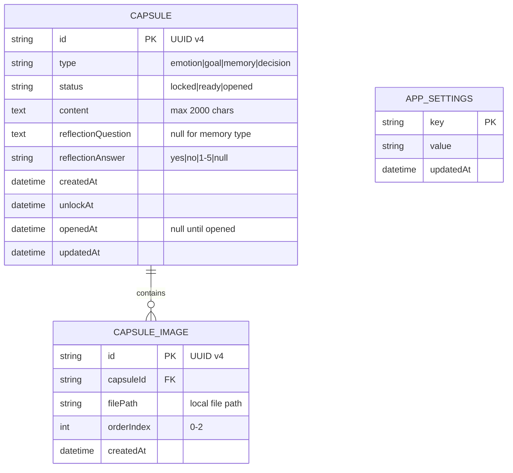
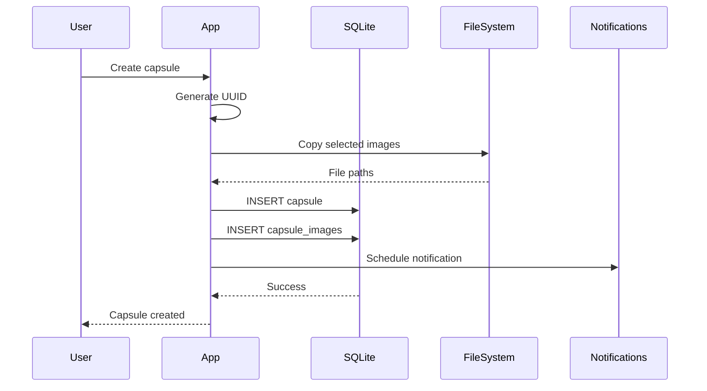
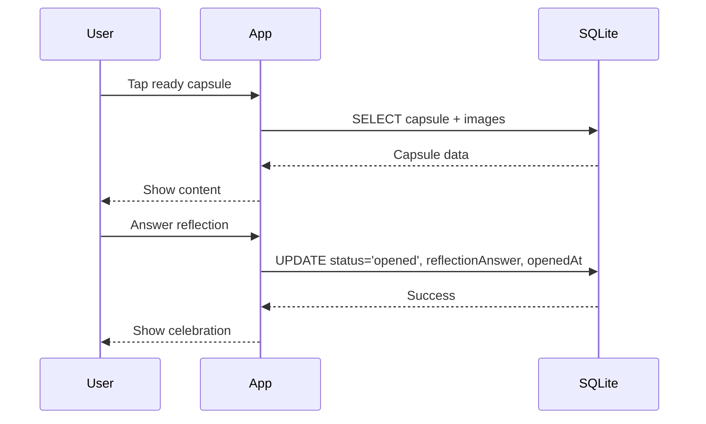
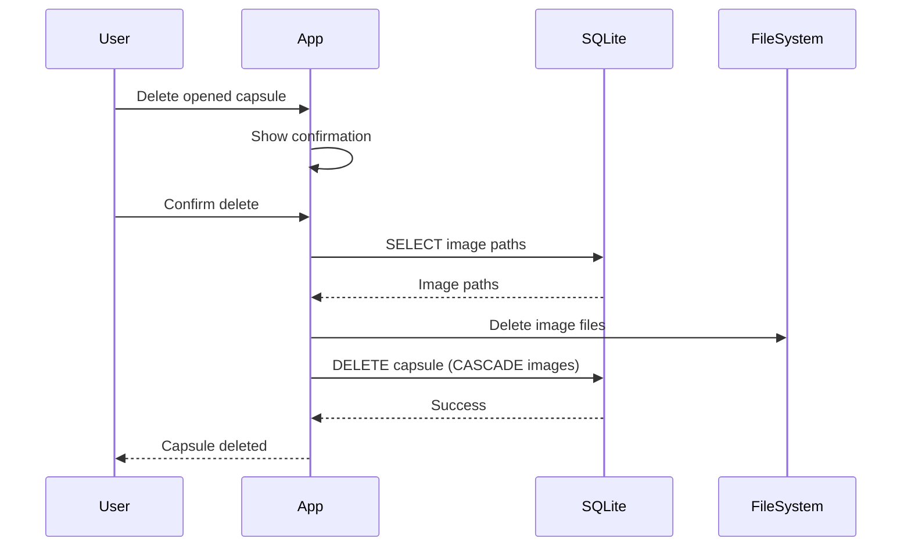
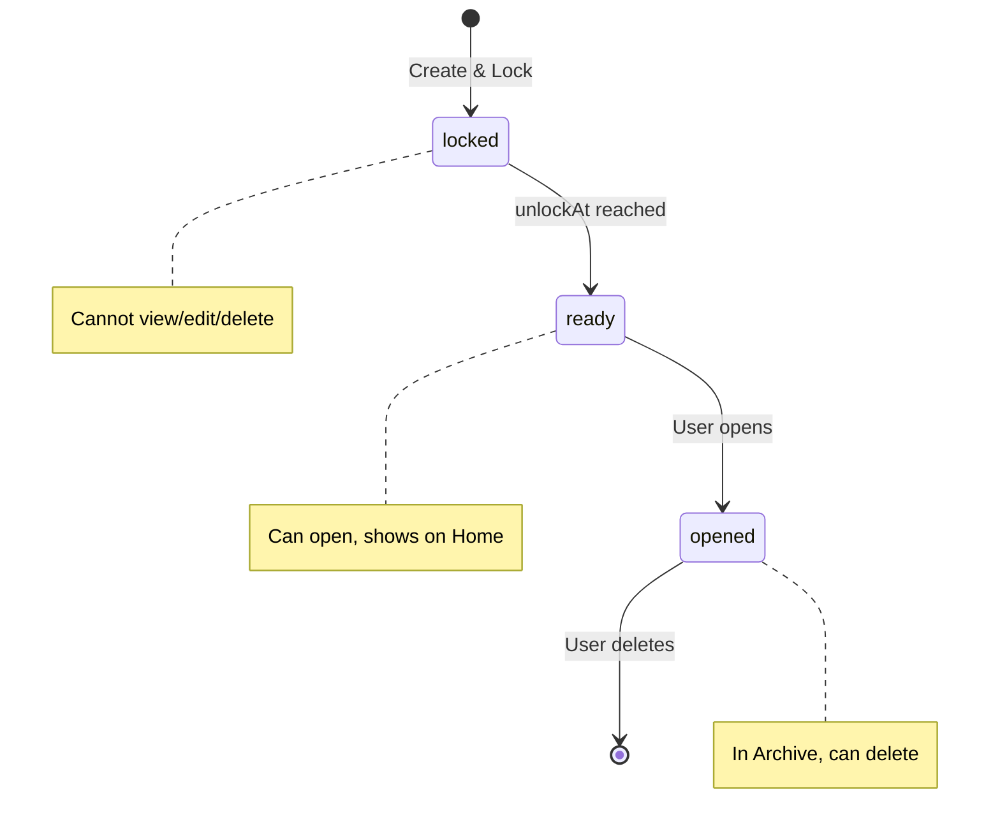

# Database Schema Design
# FutureBoxes - Time Capsule App

**Version:** 1.0
**Last Updated:** 2025-12-24

---

## 1. Overview

FutureBoxes su dung SQLite lam local database. Tat ca du lieu duoc luu tru tren device, khong co backend/cloud sync.

### Storage Strategy

| Data Type | Storage |
|-----------|---------|
| Capsule metadata | SQLite (expo-sqlite) |
| Images | Local file system (expo-file-system) |
| App settings | AsyncStorage |

---

## 2. Entity-Relationship Diagram (ERD)



---

## 3. Table Schemas

### 3.1 CAPSULE

Main table luu tru thong tin capsule.

| Column | Type | Constraints | Description |
|--------|------|-------------|-------------|
| `id` | TEXT | PRIMARY KEY | UUID v4 |
| `type` | TEXT | NOT NULL, CHECK | 'emotion', 'goal', 'memory', 'decision' |
| `status` | TEXT | NOT NULL, DEFAULT 'locked' | 'locked', 'ready', 'opened' |
| `content` | TEXT | NOT NULL | Noi dung text (max 2000 chars) |
| `reflectionQuestion` | TEXT | NULL | Cau hoi reflection (required for emotion/goal/decision) |
| `reflectionAnswer` | TEXT | NULL | Cau tra loi: 'yes', 'no', '1'-'5' |
| `createdAt` | INTEGER | NOT NULL | Unix timestamp (ms) |
| `unlockAt` | INTEGER | NOT NULL | Unix timestamp (ms) - thoi diem mo |
| `openedAt` | INTEGER | NULL | Unix timestamp (ms) - thoi diem thuc su mo |
| `updatedAt` | INTEGER | NOT NULL | Unix timestamp (ms) |

**SQL Create Statement:**

```sql
CREATE TABLE IF NOT EXISTS capsule (
    id TEXT PRIMARY KEY,
    type TEXT NOT NULL CHECK (type IN ('emotion', 'goal', 'memory', 'decision')),
    status TEXT NOT NULL DEFAULT 'locked' CHECK (status IN ('locked', 'ready', 'opened')),
    content TEXT NOT NULL,
    reflectionQuestion TEXT,
    reflectionAnswer TEXT CHECK (reflectionAnswer IN ('yes', 'no', '1', '2', '3', '4', '5') OR reflectionAnswer IS NULL),
    createdAt INTEGER NOT NULL,
    unlockAt INTEGER NOT NULL,
    openedAt INTEGER,
    updatedAt INTEGER NOT NULL
);
```

**Validation Rules:**

| Rule | Description |
|------|-------------|
| V1 | `content` length <= 2000 characters |
| V2 | `unlockAt` > `createdAt` (thoi gian mo phai o tuong lai) |
| V3 | `reflectionQuestion` required khi type != 'memory' |
| V4 | `reflectionAnswer` chi duoc set khi status = 'opened' |
| V5 | `openedAt` chi duoc set khi status = 'opened' |

---

### 3.2 CAPSULE_IMAGE

Luu tru reference den cac anh cua capsule.

| Column | Type | Constraints | Description |
|--------|------|-------------|-------------|
| `id` | TEXT | PRIMARY KEY | UUID v4 |
| `capsuleId` | TEXT | NOT NULL, FOREIGN KEY | Reference den capsule.id |
| `filePath` | TEXT | NOT NULL | Duong dan file anh tren device |
| `orderIndex` | INTEGER | NOT NULL | Thu tu hien thi (0, 1, 2) |
| `createdAt` | INTEGER | NOT NULL | Unix timestamp (ms) |

**SQL Create Statement:**

```sql
CREATE TABLE IF NOT EXISTS capsule_image (
    id TEXT PRIMARY KEY,
    capsuleId TEXT NOT NULL,
    filePath TEXT NOT NULL,
    orderIndex INTEGER NOT NULL CHECK (orderIndex >= 0 AND orderIndex <= 2),
    createdAt INTEGER NOT NULL,
    FOREIGN KEY (capsuleId) REFERENCES capsule(id) ON DELETE CASCADE
);
```

**Constraints:**

| Constraint | Description |
|------------|-------------|
| Max 3 images | Moi capsule toi da 3 anh (orderIndex 0-2) |
| Unique order | Khong co 2 anh cung orderIndex trong 1 capsule |
| Cascade delete | Xoa capsule -> xoa tat ca images |

---

### 3.3 APP_SETTINGS (AsyncStorage)

Luu tru settings cua app. Su dung AsyncStorage (key-value).

| Key | Type | Default | Description |
|-----|------|---------|-------------|
| `onboardingCompleted` | boolean | false | Da xem onboarding chua |
| `notificationPermission` | boolean | false | Da cap quyen notification chua |
| `firstLaunch` | boolean | true | Lan dau mo app |
| `lastStatusCheck` | number | null | Timestamp lan cuoi check capsule status |

---

## 4. Indexing Strategy

### Primary Indexes (Automatic)

| Table | Column | Type |
|-------|--------|------|
| capsule | id | PRIMARY KEY |
| capsule_image | id | PRIMARY KEY |

### Secondary Indexes

```sql
-- Index cho Home Screen query (6 capsules gan nhat, status locked/ready)
CREATE INDEX idx_capsule_unlock_status
ON capsule(unlockAt ASC, status)
WHERE status IN ('locked', 'ready');

-- Index cho Archive query (capsules da mo, moi nhat truoc)
CREATE INDEX idx_capsule_opened
ON capsule(openedAt DESC)
WHERE status = 'opened';

-- Index cho capsule images lookup
CREATE INDEX idx_image_capsule
ON capsule_image(capsuleId, orderIndex);

-- Index cho timer/notification check
CREATE INDEX idx_capsule_pending_unlock
ON capsule(unlockAt ASC)
WHERE status = 'locked';
```

### Index Usage

| Query | Index Used |
|-------|------------|
| Home Screen: 6 upcoming capsules | `idx_capsule_unlock_status` |
| Archive: opened capsules | `idx_capsule_opened` |
| Get images for capsule | `idx_image_capsule` |
| Background check for ready capsules | `idx_capsule_pending_unlock` |

---

## 5. File Storage Structure

### Image Storage

```
{documentDirectory}/
  capsule_images/
    {capsuleId}/
      {imageId}_0.jpg  (orderIndex 0)
      {imageId}_1.jpg  (orderIndex 1)
      {imageId}_2.jpg  (orderIndex 2)
```

### File Operations

| Operation | Method |
|-----------|--------|
| Save image | `FileSystem.copyAsync()` from picker |
| Read image | Direct path reference |
| Delete image | `FileSystem.deleteAsync()` |
| Delete capsule images | Delete folder `{capsuleId}/` |

---

## 6. Data Flow

### 6.1 Create Capsule Flow



### 6.2 Open Capsule Flow



### 6.3 Delete Capsule Flow



---

## 7. Status Transitions



### Transition Rules

| From | To | Trigger | Actions |
|------|----|---------|---------|
| - | locked | User locks capsule | Save to DB, schedule notification |
| locked | ready | Background check: now >= unlockAt | Update status, show notification |
| ready | opened | User taps Open | Show content, get reflection, update status |
| opened | deleted | User confirms delete | Delete from DB, delete files |

---

## 8. Queries Reference

### Home Screen Query

```sql
SELECT c.*,
       (SELECT GROUP_CONCAT(filePath, ',')
        FROM capsule_image ci
        WHERE ci.capsuleId = c.id
        ORDER BY ci.orderIndex) as imagePaths
FROM capsule c
WHERE c.status IN ('locked', 'ready')
ORDER BY c.unlockAt ASC
LIMIT 6;
```

### Archive Query

```sql
SELECT c.*,
       (SELECT GROUP_CONCAT(filePath, ',')
        FROM capsule_image ci
        WHERE ci.capsuleId = c.id
        ORDER BY ci.orderIndex) as imagePaths
FROM capsule c
WHERE c.status = 'opened'
ORDER BY c.openedAt DESC;
```

### Status Update Query (Background Task)

```sql
UPDATE capsule
SET status = 'ready',
    updatedAt = ?
WHERE status = 'locked'
  AND unlockAt <= ?;
```

### Delete Capsule

```sql
-- Get images first
SELECT filePath FROM capsule_image WHERE capsuleId = ?;

-- Delete (images auto-deleted by CASCADE)
DELETE FROM capsule WHERE id = ?;
```

---

## 9. Migration Strategy

### Version 1 (Initial)

```sql
-- Create tables
CREATE TABLE IF NOT EXISTS capsule (...);
CREATE TABLE IF NOT EXISTS capsule_image (...);

-- Create indexes
CREATE INDEX IF NOT EXISTS idx_capsule_unlock_status ...;
CREATE INDEX IF NOT EXISTS idx_capsule_opened ...;
CREATE INDEX IF NOT EXISTS idx_image_capsule ...;
CREATE INDEX IF NOT EXISTS idx_capsule_pending_unlock ...;
```

### Future Migrations

| Version | Changes |
|---------|---------|
| v2 | Add `tags` table for categorization |
| v3 | Add `backup_status` column for cloud sync |

### Migration Implementation

```typescript
const CURRENT_DB_VERSION = 1;

const migrations = {
  1: (db: SQLiteDatabase) => {
    // Create initial schema
  },
  // Future migrations...
};

async function runMigrations(db: SQLiteDatabase) {
  const currentVersion = await getDBVersion(db);
  for (let v = currentVersion + 1; v <= CURRENT_DB_VERSION; v++) {
    await migrations[v](db);
    await setDBVersion(db, v);
  }
}
```

---

## 10. Performance Considerations

| Consideration | Solution |
|---------------|----------|
| Large number of capsules | Pagination, indexes |
| Image loading | Lazy loading, caching |
| Background status checks | Efficient indexed query |
| App startup | Load only Home Screen data initially |

### Query Performance Targets

| Query | Target |
|-------|--------|
| Home Screen load | < 50ms |
| Archive list load | < 100ms |
| Single capsule load | < 30ms |
| Status update batch | < 20ms |

---

*Schema Design End*
