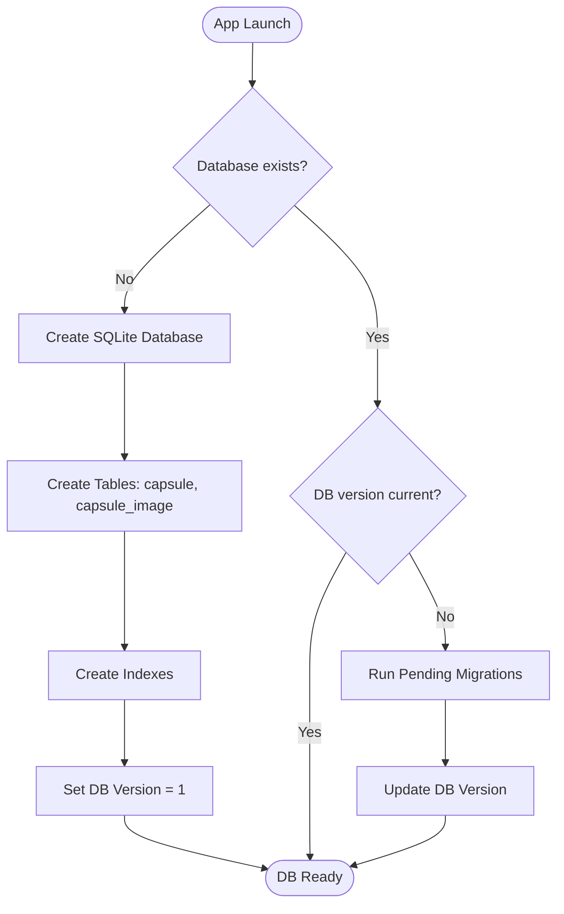
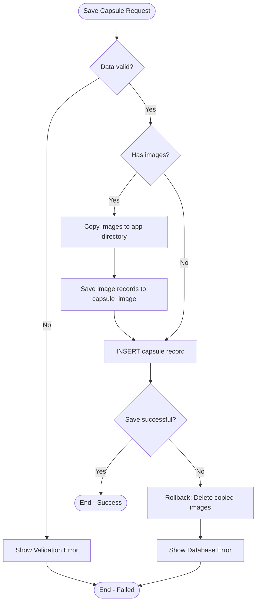
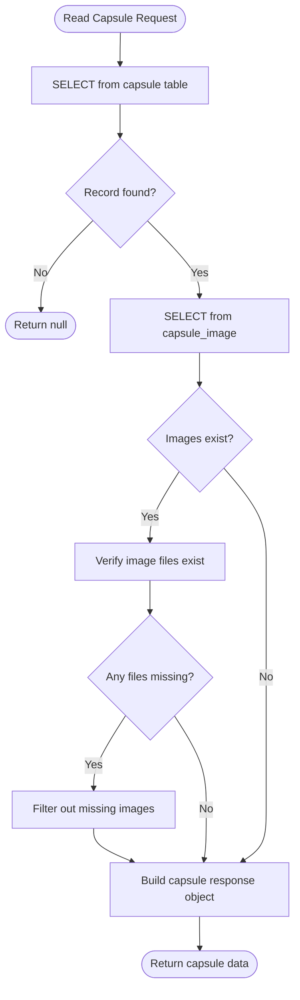
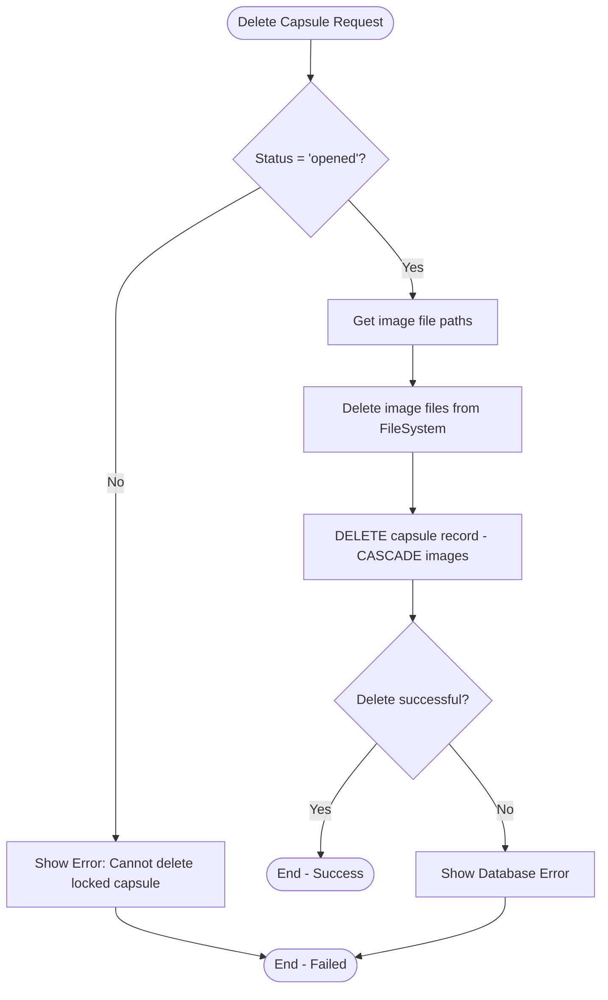
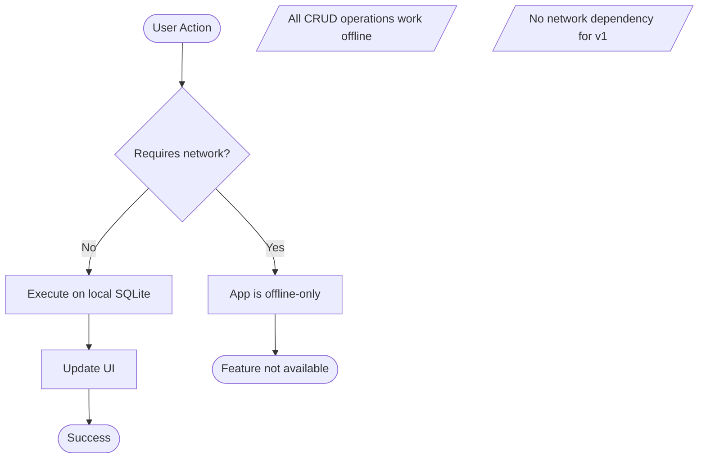

# F1: Local Data Storage - Activity Diagram

**Feature:** Local Data Storage
**Priority:** Must Have
**Dependencies:** None

---

## 1. Overview

Feature nay cung cap kha nang luu tru du lieu capsules tren device su dung SQLite va FileSystem. Nguoi dung co the su dung app hoan toan offline.

---

## 2. Activity Diagram - Database Initialization

---

## 3. Activity Diagram - Save Capsule Data

---

## 4. Activity Diagram - Read Capsule Data

---

## 5. Activity Diagram - Delete Capsule Data

---

## 6. Activity Diagram - Offline Operation

---

## 7. User Interaction Flow

### 7.1 App First Launch

1. User mo app lan dau
2. App tu dong tao SQLite database
3. App tao cac tables va indexes
4. App set version = 1
5. App san sang su dung

### 7.2 Save Data

1. User tao capsule moi
2. App validate du lieu (content required, images max 3)
3. Neu co anh: copy anh vao app directory
4. App INSERT capsule record
5. App INSERT capsule_image records (neu co)
6. Hien thi thanh cong hoac loi

### 7.3 Read Data

1. App query SQLite khi can hien thi capsule
2. Join voi capsule_image de lay duong dan anh
3. Verify anh ton tai tren filesystem
4. Tra ve du lieu hoan chinh

### 7.4 Delete Data

1. User xoa capsule da mo
2. App lay danh sach file anh
3. App xoa file anh khoi filesystem
4. App DELETE capsule (CASCADE xoa images)
5. Update UI

---

## 8. Error Handling

| Error | Handling |
|-------|----------|
| Database creation failed | Show fatal error, ask user to reinstall |
| Insert failed | Rollback image copies, show error message |
| Read failed | Return empty/null, show error message |
| Delete failed | Show error, allow retry |
| Image file missing | Filter out, continue with available images |
| Storage full | Show warning before saving |

---

## 9. Data Persistence Guarantee

| Scenario | Data Status |
|----------|-------------|
| App killed | Data persisted |
| Device restart | Data persisted |
| App update | Data persisted (migration if needed) |
| App uninstall | Data LOST |
| Clear app data | Data LOST |

---

*F1 Activity Diagram End*
