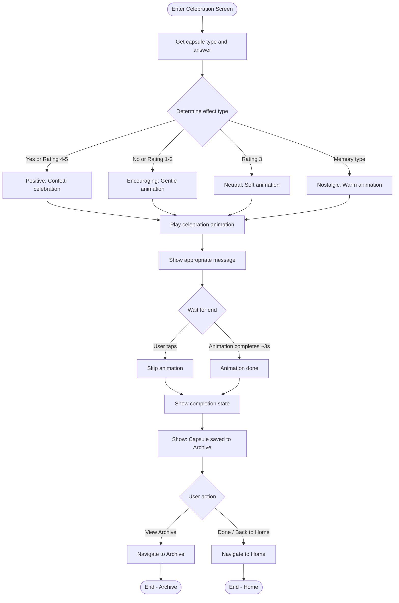

# F10: Celebration Effects - Activity Diagram

**Feature:** Celebration Effects
**Priority:** Should Have
**Dependencies:** F9 (Reflection Response)

---

## 1. Overview

Hieu ung celebration hien thi sau khi nguoi dung tra loi reflection hoac mo Memory capsule. Hieu ung thay doi tuy theo cau tra loi: tich cuc (confetti), trung tinh, hoac dong vien. Co the skip bang cach tap.

---

## 2. Activity Diagram - Celebration Flow



---

## 3. Effect Types

### 3.1 Positive Effect (Confetti)

**Trigger:** Yes answer, Rating 4-5

```
+----------------------------------+
|                                  |
|     * *  *  * *  *  * *          |
|   *    *  *    *  *    *         |
|     *  *  *  *  *  *  *          |
|                                  |
|         [Party Icon]             |
|                                  |
|      Congratulations!            |
|                                  |
|   You achieved your goal!        |
|   Keep up the great work!        |
|                                  |
|                                  |
|  [View Archive]    [Done]        |
|                                  |
+----------------------------------+
```

### 3.2 Encouraging Effect

**Trigger:** No answer, Rating 1-2

```
+----------------------------------+
|                                  |
|        ~  ~  ~  ~  ~             |
|      ~    ~    ~    ~            |
|                                  |
|         [Heart Icon]             |
|                                  |
|      That's okay!                |
|                                  |
|   Every experience teaches us    |
|   something. You're still        |
|   growing!                       |
|                                  |
|                                  |
|  [View Archive]    [Done]        |
|                                  |
+----------------------------------+
```

### 3.3 Neutral Effect

**Trigger:** Rating 3

```
+----------------------------------+
|                                  |
|        .  .  .  .  .             |
|      .    .    .    .            |
|                                  |
|        [Sparkle Icon]            |
|                                  |
|      Life is a journey           |
|                                  |
|   Not every decision is          |
|   black or white. You're         |
|   doing your best!               |
|                                  |
|                                  |
|  [View Archive]    [Done]        |
|                                  |
+----------------------------------+
```

### 3.4 Nostalgic Effect (Memory)

**Trigger:** Memory capsule opened

```
+----------------------------------+
|                                  |
|      *    *    *    *            |
|        *    *    *               |
|                                  |
|        [Camera Icon]             |
|                                  |
|      A moment captured           |
|                                  |
|   This memory is now             |
|   forever preserved in           |
|   your archive.                  |
|                                  |
|                                  |
|  [View Archive]    [Done]        |
|                                  |
+----------------------------------+
```

---

## 4. Effect Mapping Table

| Capsule Type | Answer | Effect | Message Theme |
|--------------|--------|--------|---------------|
| Emotion | Yes | Positive | Celebration, encouragement |
| Emotion | No | Encouraging | Comfort, growth mindset |
| Goal | Yes | Positive | Achievement, pride |
| Goal | No | Encouraging | Motivation, keep trying |
| Decision | 5 | Positive | Great decision |
| Decision | 4 | Positive | Good decision |
| Decision | 3 | Neutral | Balanced perspective |
| Decision | 2 | Encouraging | Learning experience |
| Decision | 1 | Encouraging | Growth opportunity |
| Memory | N/A | Nostalgic | Preservation, warmth |

---

## 5. Animation Specifications

### 5.1 Positive (Confetti)

| Element | Animation | Duration |
|---------|-----------|----------|
| Confetti particles | Fall from top, rotate, fade | 3000ms |
| Colors | Multi-color (gold, blue, pink, green) | - |
| Count | 50-100 particles | - |
| Icon | Scale bounce, glow | 500ms |
| Text | Fade in, slight bounce | 400ms |
| Haptic | Success vibration | 100ms |

### 5.2 Encouraging

| Element | Animation | Duration |
|---------|-----------|----------|
| Hearts/bubbles | Float up gently, fade | 2500ms |
| Colors | Soft pink, lavender | - |
| Count | 20-30 particles | - |
| Icon | Gentle pulse | 500ms |
| Text | Fade in softly | 400ms |
| Haptic | Light tap | 50ms |

### 5.3 Neutral

| Element | Animation | Duration |
|---------|-----------|----------|
| Sparkles | Gentle twinkle | 2500ms |
| Colors | Blue, silver | - |
| Count | 15-20 particles | - |
| Icon | Subtle glow | 500ms |
| Text | Fade in | 400ms |
| Haptic | None | - |

### 5.4 Nostalgic

| Element | Animation | Duration |
|---------|-----------|----------|
| Warm glow | Expand from center | 2000ms |
| Stars | Gentle fade in/out | 2500ms |
| Colors | Warm orange, yellow | - |
| Icon | Soft pulse | 500ms |
| Text | Fade in | 400ms |
| Haptic | Soft tap | 50ms |

---

## 6. User Interaction Flow

### 6.1 Xem celebration

1. User hoan thanh Reflection (hoac mo Memory)
2. App hien thi celebration screen
3. Animation tu dong chay
4. Message tuong ung hien thi
5. Sau 3 giay, buttons hien ro rang hon

### 6.2 Skip animation

1. Animation dang chay
2. User tap anywhere
3. Animation dung ngay
4. Hien thi completion state voi buttons

### 6.3 Ket thuc

1. User tap "Done" hoac "View Archive"
2. Navigate den destination tuong ung
3. Capsule da duoc luu vao Archive

---

## 7. Messages Library

### 7.1 Positive Messages

```typescript
const positiveMessages = [
  {
    title: "Congratulations!",
    subtitle: "You achieved your goal! Keep up the great work!"
  },
  {
    title: "Amazing!",
    subtitle: "Your hard work paid off. You should be proud!"
  },
  {
    title: "You did it!",
    subtitle: "This is a moment worth celebrating!"
  }
];
```

### 7.2 Encouraging Messages

```typescript
const encouragingMessages = [
  {
    title: "That's okay!",
    subtitle: "Every experience teaches us something. You're still growing!"
  },
  {
    title: "Keep going!",
    subtitle: "Setbacks are setups for comebacks. You've got this!"
  },
  {
    title: "You're learning!",
    subtitle: "Growth isn't always linear. Every step counts."
  }
];
```

### 7.3 Neutral Messages

```typescript
const neutralMessages = [
  {
    title: "Life is a journey",
    subtitle: "Not every decision is black or white. You're doing your best!"
  },
  {
    title: "Balanced view",
    subtitle: "Sometimes the middle ground is exactly where we need to be."
  }
];
```

### 7.4 Nostalgic Messages

```typescript
const nostalgicMessages = [
  {
    title: "A moment captured",
    subtitle: "This memory is now forever preserved in your archive."
  },
  {
    title: "Time capsule opened",
    subtitle: "Some moments are worth keeping forever."
  }
];
```

---

## 8. UI Components

### 8.1 Screen Layout

```
+----------------------------------+
|                                  |
|    [Animation Canvas Area]       |
|    Full screen particles         |
|                                  |
|         [Center Icon]            |
|                                  |
|         [Title Text]             |
|                                  |
|       [Subtitle Text]            |
|                                  |
|                                  |
|                                  |
|  [View Archive]       [Done]     |
|                                  |
+----------------------------------+
```

### 8.2 Button Styles

| Button | Style |
|--------|-------|
| View Archive | Secondary, outline |
| Done | Primary, filled |

---

## 9. Technical Implementation

### 9.1 Animation Library

```typescript
// Using Lottie for complex animations
import LottieView from 'lottie-react-native';

// Or custom particles with Reanimated
import Animated, {
  useSharedValue,
  useAnimatedStyle,
  withTiming,
  withRepeat,
} from 'react-native-reanimated';
```

### 9.2 Effect Selection

```typescript
function getEffectType(type: string, answer: string | null): EffectType {
  if (type === 'memory') return 'nostalgic';

  if (answer === 'yes') return 'positive';
  if (answer === 'no') return 'encouraging';

  const rating = parseInt(answer || '3');
  if (rating >= 4) return 'positive';
  if (rating <= 2) return 'encouraging';
  return 'neutral';
}
```

---

## 10. Navigation After Celebration

| Button | Destination | Action |
|--------|-------------|--------|
| Done | Home Screen | Pop to Home |
| View Archive | Archive Screen | Navigate to Archive |
| Hardware back | Home Screen | Pop to Home |

---

## 11. Accessibility

| Aspect | Implementation |
|--------|----------------|
| Reduce motion | Show static completion screen |
| Screen reader | Announce title and subtitle |
| Auto-read | Delay 500ms before reading |
| Skip | Any tap skips animation |

---

## 12. Performance

| Consideration | Solution |
|---------------|----------|
| Particle count | Limit to 100 max |
| Frame rate | Target 60fps |
| Memory | Dispose animation after completion |
| Battery | Stop animation when backgrounded |

---

## 13. Error Handling

| Error | Handling |
|-------|----------|
| Animation load failed | Show static completion screen |
| Navigation failed | Show error, retry buttons |
| Missing answer data | Default to neutral effect |

---

*F10 Activity Diagram End*
