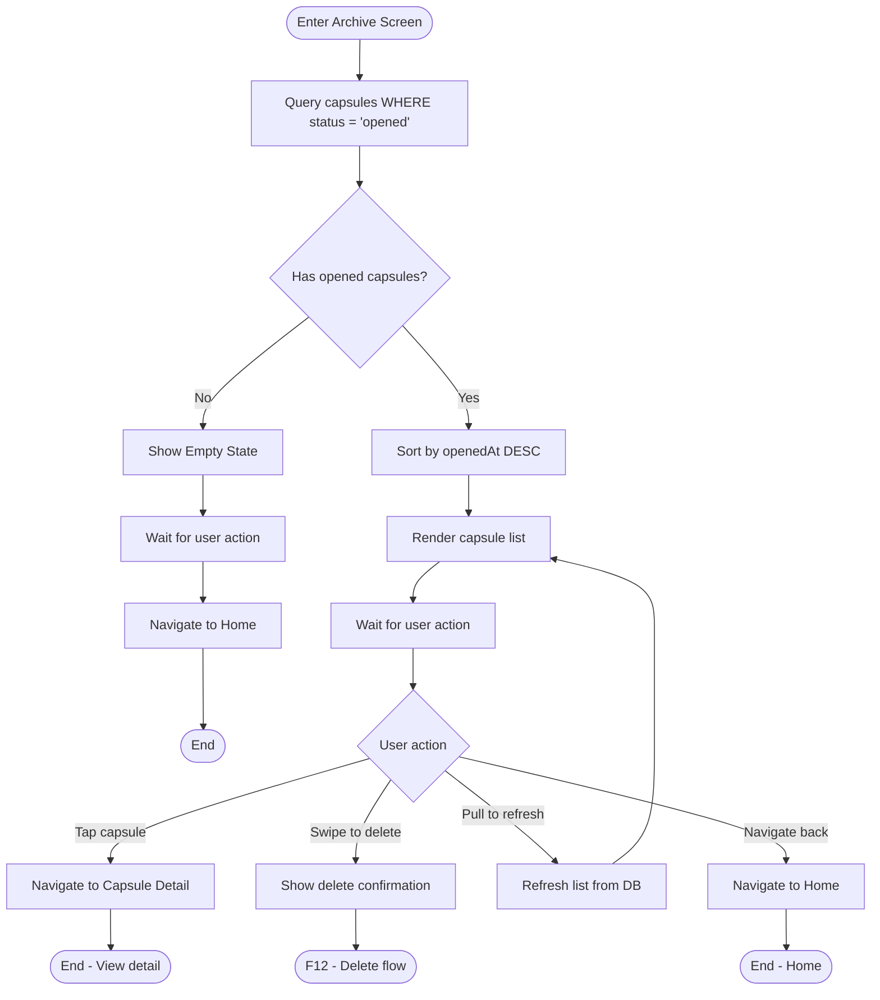
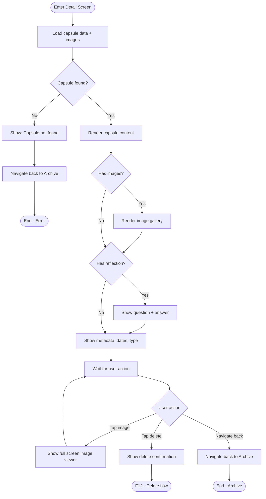

# F11: Archive/History - Activity Diagram

**Feature:** Archive/History
**Priority:** Must Have
**Dependencies:** F8 (Open Capsule)

---

## 1. Overview

Archive la noi luu tru va hien thi tat ca capsules da mo. Nguoi dung co the xem lai noi dung, cau tra loi reflection, va thong tin chi tiet cua moi capsule. Sap xep theo ngay mo (moi nhat truoc).

---

## 2. Activity Diagram - Archive List Flow



---

## 3. Activity Diagram - View Capsule Detail



---

## 4. UI Components

### 4.1 Archive List Screen

```
+----------------------------------+
|  [<- Back]       Archive         |
+----------------------------------+
|                                  |
|  +----------------------------+  |
|  | [Icon] Emotion             |  |
|  | Opened Dec 24, 2025        |  |
|  | "I'm feeling really exc... |  |
|  +----------------------------+  |
|                                  |
|  +----------------------------+  |
|  | [Icon] Goal                |  |
|  | Opened Dec 20, 2025        |  |
|  | "My goal for this year... |  |
|  +----------------------------+  |
|                                  |
|  +----------------------------+  |
|  | [Icon] Memory              |  |
|  | Opened Dec 15, 2025        |  |
|  | "Our trip to the beach... |  |
|  +----------------------------+  |
|                                  |
|  [Scroll for more...]            |
|                                  |
+----------------------------------+
```

### 4.2 Archive List Item

```
+----------------------------------+
| [Type Icon]   [Type Name]        |
| Opened [date]    Created [date]  |
| -------------------------------- |
| "Preview of content text..."     |
| [img] [img] (if has images)      |
| -------------------------------- |
| Reflection: [Yes/No or Rating]   |  <- If has reflection
+----------------------------------+
```

### 4.3 Capsule Detail Screen

```
+----------------------------------+
|  [<- Back]    Detail    [Delete] |
+----------------------------------+
|                                  |
|  [Type Icon]                     |
|  [Type Name] Capsule             |
|                                  |
|  Created: Dec 20, 2024           |
|  Opened: Dec 24, 2025            |
|  Locked for: 1 year, 4 days      |
|                                  |
|  +----------------------------+  |
|  |                            |  |
|  |  "Full content text        |  |
|  |   displayed here with      |  |
|  |   all the details..."      |  |
|  |                            |  |
|  +----------------------------+  |
|                                  |
|  [img1] [img2] [img3]            |
|                                  |
|  Your reflection:                |
|  +----------------------------+  |
|  | Q: Did you achieve it?     |  |
|  | A: Yes                     |  |
|  +----------------------------+  |
|                                  |
+----------------------------------+
```

---

## 5. User Interaction Flow

### 5.1 Xem danh sach Archive

1. User tap Archive icon tren Home
2. App query capsules co status = 'opened'
3. Sap xep theo ngay mo (moi nhat truoc)
4. Hien thi list voi preview thong tin
5. User co the scroll de xem them

### 5.2 Xem chi tiet capsule

1. User tap vao mot capsule trong list
2. App load du lieu day du tu database
3. Hien thi noi dung, anh, reflection
4. User co the tap anh de xem full screen

### 5.3 Refresh list

1. User keo xuong (pull to refresh)
2. App query lai tu database
3. List cap nhat

---

## 6. Data Display

### 6.1 List Item Data

| Field | Source | Display |
|-------|--------|---------|
| Type icon | capsule.type | Icon tuong ung |
| Type name | capsule.type | Emotion/Goal/Memory/Decision |
| Opened date | capsule.openedAt | "Opened Dec 24, 2025" |
| Content preview | capsule.content | First 50 chars + "..." |
| Image indicator | capsule_image count | "[2 photos]" |
| Reflection | capsule.reflectionAnswer | "Yes/No" or "4/5" |

### 6.2 Detail Data

| Field | Source | Display |
|-------|--------|---------|
| Type | capsule.type | Icon + Name |
| Created date | capsule.createdAt | Full date |
| Opened date | capsule.openedAt | Full date |
| Duration | openedAt - createdAt | "X years, X months, X days" |
| Full content | capsule.content | All text |
| Images | capsule_image.filePath | Image gallery |
| Reflection Q | capsule.reflectionQuestion | Full question |
| Reflection A | capsule.reflectionAnswer | Answer value |

---

## 7. Query Specifications

### 7.1 Archive List Query

```sql
SELECT
  c.id,
  c.type,
  c.content,
  c.reflectionAnswer,
  c.createdAt,
  c.openedAt,
  (SELECT COUNT(*) FROM capsule_image ci WHERE ci.capsuleId = c.id) as imageCount
FROM capsule c
WHERE c.status = 'opened'
ORDER BY c.openedAt DESC;
```

### 7.2 Detail Query

```sql
SELECT c.*
FROM capsule c
WHERE c.id = ?;

SELECT ci.filePath, ci.orderIndex
FROM capsule_image ci
WHERE ci.capsuleId = ?
ORDER BY ci.orderIndex;
```

---

## 8. List Item States

| State | Visual |
|-------|--------|
| Normal | Default background |
| Pressed | Slight darkening |
| Swiped | Reveal delete button |

---

## 9. Empty State

```
+----------------------------------+
|  [<- Back]       Archive         |
+----------------------------------+
|                                  |
|                                  |
|        [Empty Box Icon]          |
|                                  |
|     No opened capsules yet       |
|                                  |
|   When you open a time capsule,  |
|   it will appear here.           |
|                                  |
|  [    Create a Capsule    ]      |
|                                  |
|                                  |
+----------------------------------+
```

---

## 10. Swipe to Delete

| Gesture | Action |
|---------|--------|
| Swipe left | Reveal delete button |
| Tap delete | Show confirmation (F12) |
| Swipe right | Hide delete button |
| Tap elsewhere | Hide delete button |

---

## 11. Performance Considerations

| Aspect | Implementation |
|--------|----------------|
| List virtualization | FlatList with windowing |
| Image thumbnails | Use smaller size for list |
| Pagination | Load 20 items at a time (if needed) |
| Caching | Cache list data |

---

## 12. Navigation

| From | To | Trigger |
|------|----|---------|
| Home | Archive | Tap Archive icon |
| Celebration | Archive | Tap "View Archive" |
| Archive | Detail | Tap list item |
| Detail | Archive | Back button |
| Archive | Home | Back button |

---

## 13. Error Handling

| Error | Handling |
|-------|----------|
| Query failed | Show error, retry button |
| Capsule not found | Show error, go back |
| Image load failed | Show placeholder |
| Empty list | Show empty state |

---

## 14. Accessibility

| Aspect | Implementation |
|--------|----------------|
| List items | Accessible role: button |
| Screen reader | Announce type, date, preview |
| Delete action | Announce "Delete [type] capsule" |
| Images | Alt text with index |

---

*F11 Activity Diagram End*
