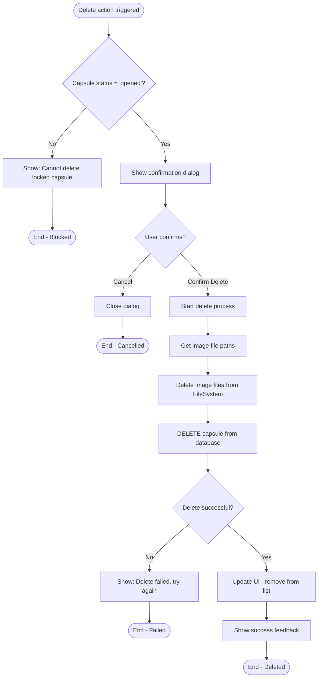
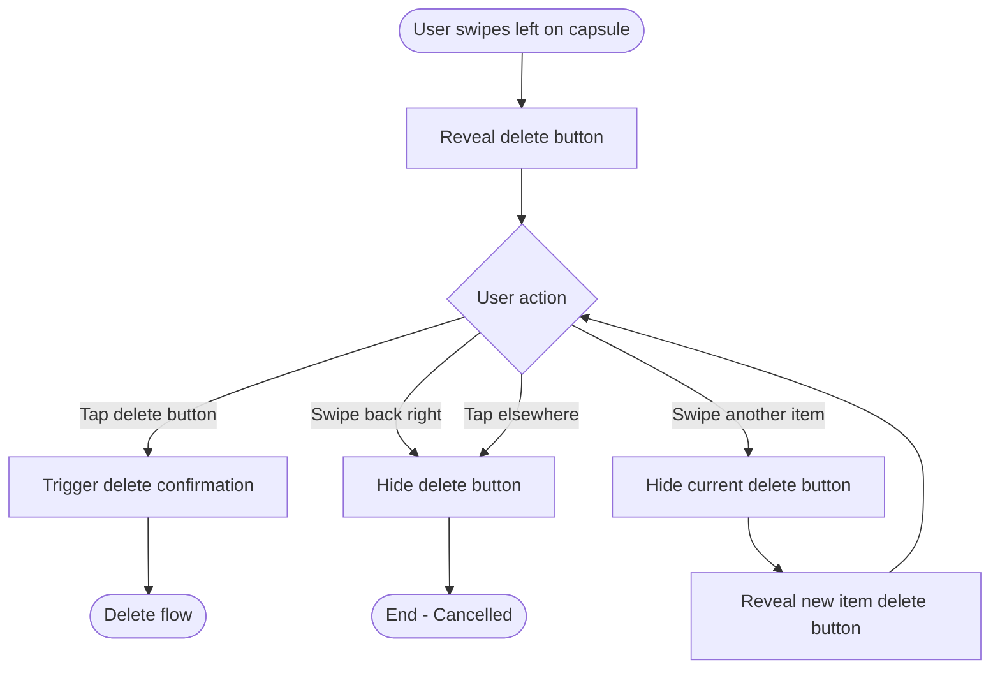

# F12: Delete Opened Capsule - Activity Diagram

**Feature:** Delete Opened Capsule
**Priority:** Should Have
**Dependencies:** F11 (Archive/History)

---

## 1. Overview

Nguoi dung co the xoa capsules da mo khoi Archive de don dep. Chi capsules co status = 'opened' moi co the xoa. Truoc khi xoa phai xac nhan. Xoa se xoa ca database record va anh lien quan.

---

## 2. Activity Diagram - Delete Flow



---

## 3. Activity Diagram - Swipe to Delete



---

## 4. UI Components

### 4.1 Delete Button (Swipe Revealed)

```
+----------------------------------+
| [Capsule Content]     | [Delete] |
+----------------------------------+
```

### 4.2 Confirmation Dialog

```
+----------------------------------+
|                                  |
|     [Warning Icon]               |
|                                  |
|     Delete this capsule?         |
|                                  |
|     This will permanently        |
|     delete this time capsule     |
|     and all its photos.          |
|                                  |
|     This cannot be undone.       |
|                                  |
|  [Cancel]      [Delete Forever]  |
|                                  |
+----------------------------------+
```

### 4.3 Delete Button in Detail Screen

```
+----------------------------------+
|  [<- Back]    Detail    [Delete] |
+----------------------------------+
```

---

## 5. User Interaction Flow

### 5.1 Xoa tu Archive List (Swipe)

1. User o Archive list screen
2. User swipe left tren capsule muon xoa
3. Delete button hien ra
4. User tap Delete button
5. Confirmation dialog hien len
6. User confirm hoac cancel

### 5.2 Xoa tu Detail Screen

1. User dang xem Capsule Detail
2. User tap Delete icon (header right)
3. Confirmation dialog hien len
4. User confirm hoac cancel
5. Neu confirm, navigate back to Archive

### 5.3 Cancel delete

1. Confirmation dialog hien len
2. User tap Cancel
3. Dialog dong
4. Khong co gi thay doi

### 5.4 Confirm delete

1. Confirmation dialog hien len
2. User tap "Delete Forever"
3. App xoa image files
4. App xoa database record
5. App update UI (remove from list)
6. Show success toast

---

## 6. Delete Process

### 6.1 Steps

| Step | Action | Error Handling |
|------|--------|----------------|
| 1 | Verify status = 'opened' | Block if locked |
| 2 | Get image file paths | Continue if no images |
| 3 | Delete image files | Log warning if fail, continue |
| 4 | DELETE capsule record | CASCADE deletes image records |
| 5 | Update UI | Remove from list |
| 6 | Show feedback | Toast message |

### 6.2 SQL Delete

```sql
-- Images auto-deleted by CASCADE
DELETE FROM capsule WHERE id = ? AND status = 'opened';
```

### 6.3 File System Delete

```typescript
async function deleteCapsuleImages(capsuleId: string) {
  const folderPath = `${documentDirectory}capsule_images/${capsuleId}/`;

  try {
    const folderInfo = await FileSystem.getInfoAsync(folderPath);
    if (folderInfo.exists) {
      await FileSystem.deleteAsync(folderPath, { idempotent: true });
    }
  } catch (error) {
    console.warn('Failed to delete images folder:', error);
    // Continue with database delete
  }
}
```

---

## 7. Validation Rules

| Rule | Enforcement |
|------|-------------|
| Only opened capsules | Check status before showing delete option |
| Confirmation required | Dialog must be confirmed |
| No batch delete | One at a time |

---

## 8. UI Feedback

### 8.1 Success

```
+----------------------------------+
|  [Check Icon] Capsule deleted    |
+----------------------------------+
```

Toast hien 2 giay, tu dong an.

### 8.2 Error

```
+----------------------------------+
|  [X Icon] Failed to delete       |
|           Please try again       |
+----------------------------------+
```

Toast hien 3 giay voi retry option.

---

## 9. Animation Specs

### 9.1 Swipe to Reveal

| Animation | Duration |
|-----------|----------|
| Swipe threshold | 80px |
| Reveal animation | 200ms ease-out |
| Delete button width | 80px |
| Background color | Red (#FF3B30) |

### 9.2 Delete Confirmation

| Animation | Duration |
|-----------|----------|
| Dialog fade in | 200ms |
| Dialog scale | 0.9 -> 1.0 |
| Backdrop fade | 200ms |

### 9.3 Remove from List

| Animation | Duration |
|-----------|----------|
| Collapse height | 300ms |
| Fade out | 200ms |
| Slide left | 200ms |

---

## 10. Accessibility

| Aspect | Implementation |
|--------|----------------|
| Swipe action | Also provide delete button in detail |
| Dialog | Focus trap, announce content |
| Delete button | Label: "Delete capsule" |
| Confirmation | Clear, descriptive text |

---

## 11. Error Handling

| Error | User Message | Action |
|-------|--------------|--------|
| Status not opened | "This capsule cannot be deleted" | Block operation |
| File delete failed | (silent) | Continue with DB delete |
| DB delete failed | "Failed to delete. Please try again." | Show retry |
| UI update failed | Refresh list | Auto-refresh |

---

## 12. Edge Cases

| Case | Handling |
|------|----------|
| Delete last capsule | Show empty state after |
| Delete while offline | Works (local only) |
| Rapid delete attempts | Debounce, show loading |
| Back during delete | Complete delete first |
| App kill during delete | May have orphan files |

---

## 13. Navigation After Delete

| Context | After Delete |
|---------|--------------|
| From Archive list | Stay on Archive, item removed |
| From Detail screen | Navigate back to Archive |

---

## 14. Security Considerations

| Aspect | Implementation |
|--------|----------------|
| Irreversible | Clearly communicate in dialog |
| No undo | Data permanently removed |
| Orphan cleanup | Background task for orphan files |

---

*F12 Activity Diagram End*
