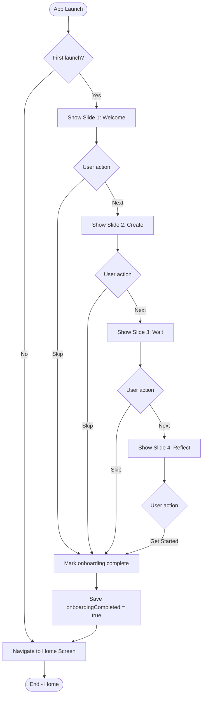
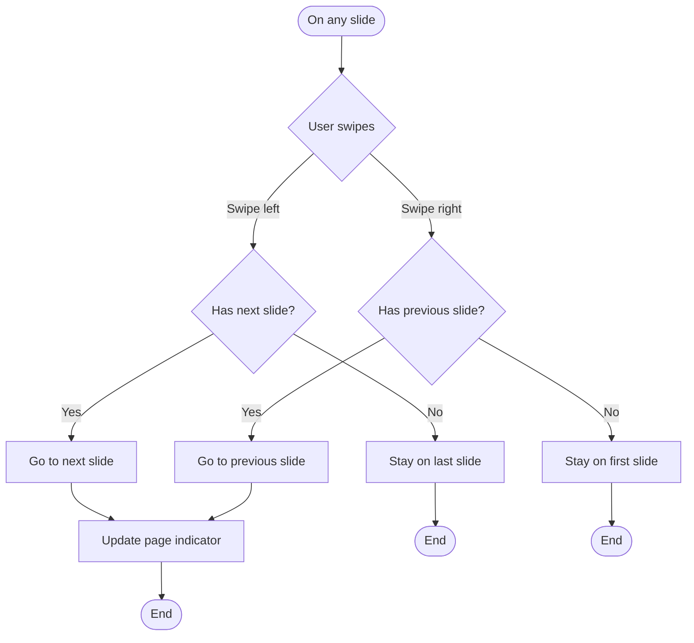
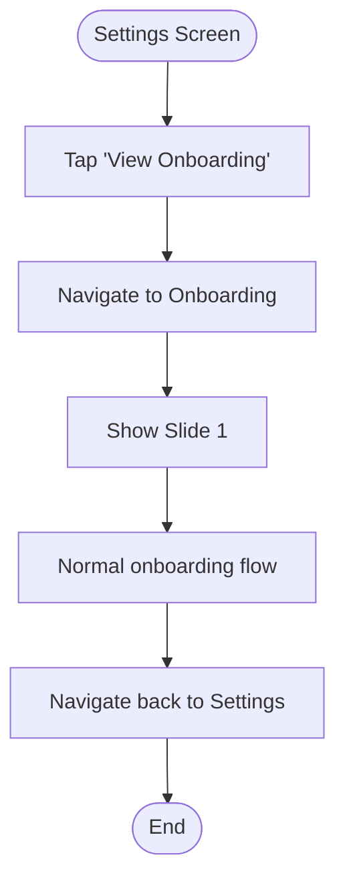

# F13: Onboarding - Activity Diagram

**Feature:** Onboarding
**Priority:** Should Have
**Dependencies:** None (Independent)

---

## 1. Overview

Onboarding gioi thieu app cho nguoi dung lan dau. Gom 3-4 slides mo ta concept time capsule va cac tinh nang chinh. Nguoi dung co the skip hoac xem het. Sau khi xong, khong hien lai o cac lan mo app sau.

---

## 2. Activity Diagram - Onboarding Flow



---

## 3. Activity Diagram - Swipe Navigation



---

## 4. Onboarding Slides Content

### Slide 1: Welcome

```
+----------------------------------+
|                [Skip]            |
+----------------------------------+
|                                  |
|                                  |
|      [Time Capsule Animation]    |
|                                  |
|                                  |
|       Welcome to FutureBoxes     |
|                                  |
|    Send messages to your         |
|    future self                   |
|                                  |
|                                  |
|       o  o  o  o                 |
|                                  |
|        [Next ->]                 |
|                                  |
+----------------------------------+
```

### Slide 2: Create

```
+----------------------------------+
|                [Skip]            |
+----------------------------------+
|                                  |
|                                  |
|      [Create Animation]          |
|      Writing/Photos              |
|                                  |
|                                  |
|       Capture the Moment         |
|                                  |
|    Write your thoughts, add      |
|    photos, and set a question    |
|    for reflection                |
|                                  |
|       o  o  o  o                 |
|                                  |
|  [<- Back]      [Next ->]        |
|                                  |
+----------------------------------+
```

### Slide 3: Wait

```
+----------------------------------+
|                [Skip]            |
+----------------------------------+
|                                  |
|                                  |
|      [Lock Animation]            |
|      Timer counting down         |
|                                  |
|                                  |
|       Lock It Away               |
|                                  |
|    Your capsule is sealed.       |
|    No peeking until the          |
|    unlock date!                  |
|                                  |
|       o  o  o  o                 |
|                                  |
|  [<- Back]      [Next ->]        |
|                                  |
+----------------------------------+
```

### Slide 4: Reflect

```
+----------------------------------+
|                                  |
+----------------------------------+
|                                  |
|                                  |
|      [Open Animation]            |
|      Celebration effects         |
|                                  |
|                                  |
|       Open & Reflect             |
|                                  |
|    When time comes, open your    |
|    capsule and see how much      |
|    you've grown                  |
|                                  |
|       o  o  o  o                 |
|                                  |
|     [Get Started]                |
|                                  |
+----------------------------------+
```

---

## 5. UI Components

### 5.1 Screen Layout

| Component | Position | Description |
|-----------|----------|-------------|
| Skip button | Top right | Text button, all slides except last |
| Illustration | Center top | Animation or image |
| Title | Center | Large, bold text |
| Subtitle | Below title | Descriptive text, 2-3 lines |
| Page indicator | Bottom area | Dots showing current slide |
| Navigation buttons | Bottom | Back/Next or Get Started |

### 5.2 Page Indicator

```
o  o  o  o    <- 4 slides
^
Current slide (filled dot)
```

### 5.3 Button States

| Slide | Back Button | Next/Action |
|-------|-------------|-------------|
| 1 | Hidden | "Next" |
| 2-3 | "Back" | "Next" |
| 4 | "Back" | "Get Started" |

---

## 6. User Interaction Flow

### 6.1 Xem het onboarding

1. User mo app lan dau
2. Slide 1 hien thi
3. User swipe left hoac tap Next
4. Chuyen sang slide 2, 3, 4
5. User tap "Get Started" o slide cuoi
6. App luu onboardingCompleted = true
7. Navigate to Home Screen

### 6.2 Skip onboarding

1. User mo app lan dau
2. User tap "Skip" o bat ky slide nao
3. App luu onboardingCompleted = true
4. Navigate to Home Screen

### 6.3 Mo app lan sau

1. User mo app
2. App check onboardingCompleted = true
3. Navigate thang den Home Screen

---

## 7. Storage

### 7.1 AsyncStorage Key

```typescript
const ONBOARDING_KEY = 'onboardingCompleted';

// Check if first launch
const isFirstLaunch = async () => {
  const value = await AsyncStorage.getItem(ONBOARDING_KEY);
  return value !== 'true';
};

// Mark onboarding complete
const completeOnboarding = async () => {
  await AsyncStorage.setItem(ONBOARDING_KEY, 'true');
};
```

---

## 8. Animation Specifications

### 8.1 Slide Transitions

| Animation | Duration |
|-----------|----------|
| Slide in/out | 300ms |
| Ease function | ease-out |
| Swipe threshold | 50px |

### 8.2 Illustrations

| Slide | Animation Type |
|-------|----------------|
| Welcome | Floating time capsule |
| Create | Writing on paper |
| Wait | Box closing, lock appearing |
| Reflect | Box opening, confetti |

Animation duration: 2-3 seconds loop

---

## 9. Navigation

| From | To | Trigger |
|------|----|---------|
| App Launch | Onboarding | First launch |
| Onboarding | Home | Skip or Get Started |
| Settings | Onboarding | (Optional) View again |

---

## 10. Accessibility

| Aspect | Implementation |
|--------|----------------|
| Screen reader | Read title and subtitle |
| Swipe | Also support button navigation |
| Animation | Respect reduce motion |
| Skip | Easy to find and tap |

---

## 11. Edge Cases

| Case | Handling |
|------|----------|
| App killed during onboarding | Not marked complete, show again |
| Skip on slide 1 | Go to Home immediately |
| Back on slide 1 | Button hidden |
| Storage write failed | Log error, allow continue |

---

## 12. Re-view Onboarding (Optional)



---

## 13. Error Handling

| Error | Handling |
|-------|----------|
| Storage read failed | Assume first launch |
| Storage write failed | Log, continue to Home |
| Animation load failed | Show static image |

---

## 14. Performance

| Aspect | Implementation |
|--------|----------------|
| Pre-load slides | Load all 4 slides on mount |
| Animation | Use Lottie for smooth performance |
| Images | Optimized size for mobile |

---

*F13 Activity Diagram End*
