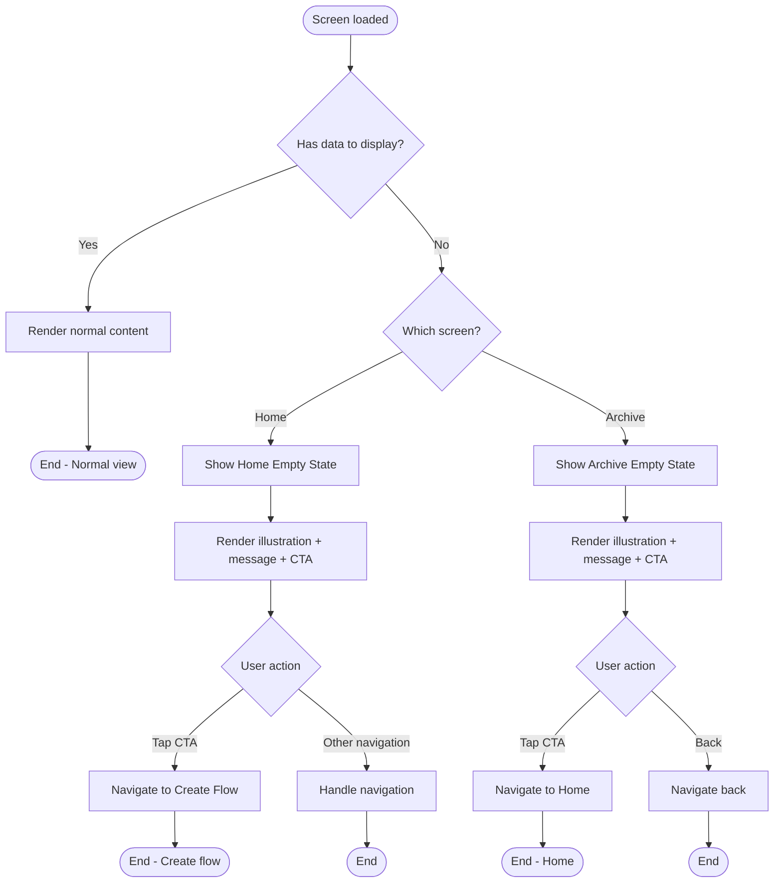
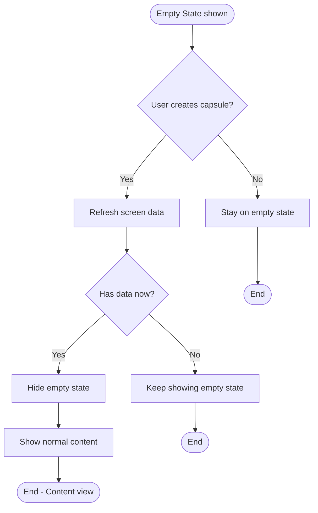

# F14: Empty States - Activity Diagram

**Feature:** Empty States
**Priority:** Should Have
**Dependencies:** F2 (Home Screen), F11 (Archive/History)

---

## 1. Overview

Empty States cung cap UI than thien khi khong co du lieu de hien thi. Gom 2 vi tri chinh: Home Screen (khi chua co capsules) va Archive (khi chua mo capsule nao). Moi empty state co illustration, message va CTA button.

---

## 2. Activity Diagram - Empty State Display



---

## 3. Activity Diagram - State Transition



---

## 4. UI Components

### 4.1 Home Screen Empty State

```
+----------------------------------+
|  [Archive Icon]   FutureBoxes    |
+----------------------------------+
|                                  |
|                                  |
|                                  |
|      [Empty Box Illustration]    |
|      Cute box waiting to         |
|      be filled                   |
|                                  |
|                                  |
|   Create your first capsule      |
|                                  |
|   Send a message to your         |
|   future self. What will you     |
|   want to remember?              |
|                                  |
|                                  |
|   [  Create Time Capsule  ]      |
|                                  |
|                                  |
+----------------------------------+
```

### 4.2 Archive Empty State

```
+----------------------------------+
|  [<- Back]       Archive         |
+----------------------------------+
|                                  |
|                                  |
|                                  |
|    [Empty Archive Illustration]  |
|    Open treasure chest           |
|    with nothing inside           |
|                                  |
|                                  |
|    No opened capsules yet        |
|                                  |
|    When you open a time          |
|    capsule, it will appear       |
|    here for you to revisit.      |
|                                  |
|                                  |
|    [  Go to Home  ]              |
|                                  |
|                                  |
+----------------------------------+
```

---

## 5. Empty State Content

### 5.1 Home Screen

| Element | Content |
|---------|---------|
| Illustration | Cute empty box or gift box waiting |
| Title | "Create your first capsule" |
| Subtitle | "Send a message to your future self. What will you want to remember?" |
| CTA Button | "Create Time Capsule" |
| CTA Action | Navigate to Type Selection |

### 5.2 Archive Screen

| Element | Content |
|---------|---------|
| Illustration | Empty treasure chest or open box |
| Title | "No opened capsules yet" |
| Subtitle | "When you open a time capsule, it will appear here for you to revisit." |
| CTA Button | "Go to Home" |
| CTA Action | Navigate to Home Screen |

---

## 6. Design Specifications

### 6.1 Layout

| Element | Position | Style |
|---------|----------|-------|
| Illustration | Center, 40% from top | 150x150px area |
| Title | Below illustration | Large, bold, center |
| Subtitle | Below title | Regular, muted, center, max 3 lines |
| CTA Button | Below subtitle, 20px margin | Primary style, full width with padding |

### 6.2 Colors

| Element | Color |
|---------|-------|
| Illustration | App accent colors |
| Title | Primary text color |
| Subtitle | Secondary text color |
| CTA Button | Primary accent |
| Background | Screen background |

### 6.3 Typography

| Element | Style |
|---------|-------|
| Title | 20px, Semi-bold |
| Subtitle | 14px, Regular, line-height 1.5 |
| CTA Button | 16px, Semi-bold |

---

## 7. User Interaction Flow

### 7.1 Home Empty State

1. User mo app (da xong onboarding)
2. App query capsules
3. Khong co capsules (hoac tat ca da opened/archived)
4. App hien thi Home Empty State
5. User tap "Create Time Capsule"
6. Navigate to Type Selection Screen

### 7.2 Archive Empty State

1. User tap Archive icon
2. App query opened capsules
3. Khong co opened capsules
4. App hien thi Archive Empty State
5. User tap "Go to Home" hoac Back
6. Navigate to Home Screen

### 7.3 Transition out of Empty

1. User tao capsule moi (Home)
2. User quay lai Home
3. Co capsule moi, khong con empty
4. Empty state an di, hien normal content

---

## 8. Illustrations

### 8.1 Home Empty Illustration

| Style | Description |
|-------|-------------|
| Theme | Cute, inviting |
| Element | Empty gift box hoac time capsule |
| Animation | Gentle float hoac pulse (optional) |
| Colors | Warm, friendly |

### 8.2 Archive Empty Illustration

| Style | Description |
|-------|-------------|
| Theme | Friendly, not sad |
| Element | Open treasure chest, empty |
| Animation | Subtle sparkle (optional) |
| Colors | Warm, encouraging |

---

## 9. Animation (Optional)

### 9.1 Illustration Animation

| Animation | Duration | Type |
|-----------|----------|------|
| Gentle float | 3s loop | translateY +/- 5px |
| Subtle pulse | 2s loop | scale 1.0 - 1.02 |
| Sparkle | 4s loop | opacity fade in/out |

### 9.2 Entry Animation

| Element | Animation | Duration |
|---------|-----------|----------|
| Illustration | Fade in + scale | 400ms |
| Title | Fade in, delay 100ms | 300ms |
| Subtitle | Fade in, delay 200ms | 300ms |
| CTA Button | Fade in, delay 300ms | 300ms |

---

## 10. Component Implementation

```typescript
interface EmptyStateProps {
  illustration: React.ReactNode;
  title: string;
  subtitle: string;
  ctaText: string;
  onCtaPress: () => void;
}

const EmptyState: React.FC<EmptyStateProps> = ({
  illustration,
  title,
  subtitle,
  ctaText,
  onCtaPress,
}) => (
  <View style={styles.container}>
    <View style={styles.illustrationContainer}>
      {illustration}
    </View>
    <Text style={styles.title}>{title}</Text>
    <Text style={styles.subtitle}>{subtitle}</Text>
    <Button
      title={ctaText}
      onPress={onCtaPress}
      style={styles.ctaButton}
    />
  </View>
);
```

---

## 11. Conditional Rendering

### 11.1 Home Screen

```typescript
const HomeScreen = () => {
  const { capsules, loading } = useCapsules();

  if (loading) return <LoadingSpinner />;

  if (capsules.length === 0) {
    return (
      <EmptyState
        illustration={<HomeEmptyIllustration />}
        title="Create your first capsule"
        subtitle="Send a message to your future self..."
        ctaText="Create Time Capsule"
        onCtaPress={() => navigation.navigate('TypeSelection')}
      />
    );
  }

  return <CapsuleGrid capsules={capsules} />;
};
```

### 11.2 Archive Screen

```typescript
const ArchiveScreen = () => {
  const { openedCapsules, loading } = useOpenedCapsules();

  if (loading) return <LoadingSpinner />;

  if (openedCapsules.length === 0) {
    return (
      <EmptyState
        illustration={<ArchiveEmptyIllustration />}
        title="No opened capsules yet"
        subtitle="When you open a time capsule..."
        ctaText="Go to Home"
        onCtaPress={() => navigation.navigate('Home')}
      />
    );
  }

  return <ArchiveList capsules={openedCapsules} />;
};
```

---

## 12. Accessibility

| Aspect | Implementation |
|--------|----------------|
| Screen reader | Read title, subtitle in order |
| Image | Decorative, mark as aria-hidden |
| CTA Button | Clear, descriptive label |
| Focus | Button should be focusable |

---

## 13. Edge Cases

| Case | Handling |
|------|----------|
| Loading state | Show loading spinner, not empty |
| Error state | Show error message, not empty |
| Partial data | Show available data, not empty |
| Very small screen | Reduce illustration size |

---

## 14. Error State (Separate from Empty)

```
+----------------------------------+
|                                  |
|      [Error Illustration]        |
|                                  |
|    Something went wrong          |
|                                  |
|    We couldn't load your         |
|    capsules. Please try again.   |
|                                  |
|    [  Try Again  ]               |
|                                  |
+----------------------------------+
```

---

*F14 Activity Diagram End*
