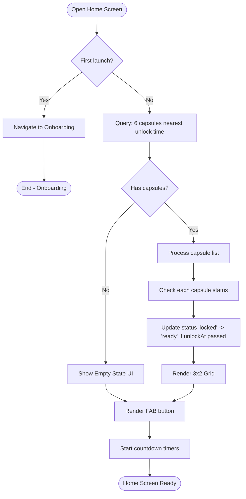
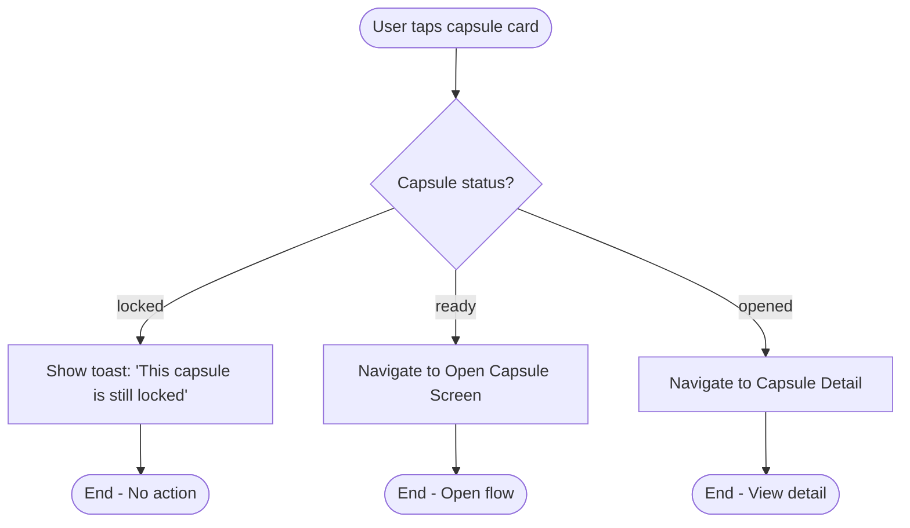
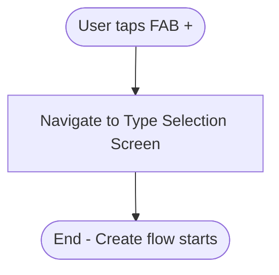
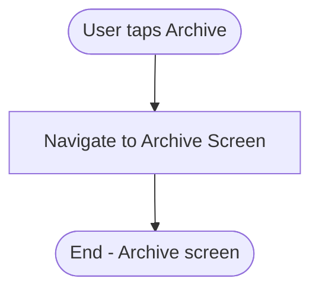
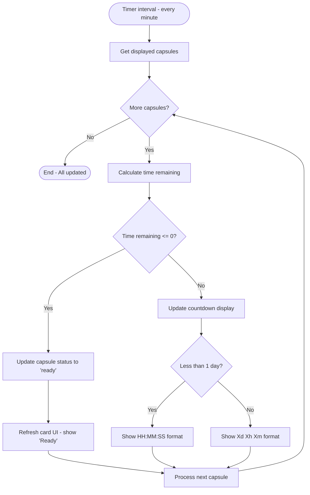

# F2: Home Screen - Activity Diagram

**Feature:** Home Screen
**Priority:** Must Have
**Dependencies:** F1 (Local Data Storage)

---

## 1. Overview

Home Screen la man hinh chinh cua app, hien thi toi da 6 capsules sap mo nhat theo dang grid 3x2. Nguoi dung co the xem countdown, tap vao capsule ready de mo, hoac tao capsule moi.

---

## 2. Activity Diagram - Load Home Screen



---

## 3. Activity Diagram - Tap Capsule



---

## 4. Activity Diagram - Create New Capsule



---

## 5. Activity Diagram - Navigate to Archive



---

## 6. Activity Diagram - Countdown Timer Update



---

## 7. UI Components

### 7.1 Home Screen Layout

```
+----------------------------------+
|  [Archive Icon]   FutureBoxes    |
+----------------------------------+
|                                  |
|  +--------+  +--------+          |
|  |Capsule1|  |Capsule2|          |
|  | 3d 5h  |  | Ready! |          |
|  +--------+  +--------+          |
|                                  |
|  +--------+  +--------+          |
|  |Capsule3|  |Capsule4|          |
|  | 1w 2d  |  | 12:30  |          |
|  +--------+  +--------+          |
|                                  |
|  +--------+  +--------+          |
|  |Capsule5|  |Capsule6|          |
|  | 2mo 5d |  | 1y 3mo |          |
|  +--------+  +--------+          |
|                                  |
|                          [+ FAB] |
+----------------------------------+
```

### 7.2 Capsule Card Components

| Component | Locked State | Ready State |
|-----------|--------------|-------------|
| Icon | Type icon (heart/target/camera/scale) | Same + glow effect |
| Badge | Countdown text | "Ready to open" badge |
| Background | Muted color | Vibrant color + pulse |
| Interaction | Show locked message | Navigate to open |

---

## 8. User Interaction Flow

### 8.1 Mo app va xem Home

1. User mo app
2. App load du lieu tu SQLite (6 capsules gan unlock nhat)
3. App check va update status cac capsule da den gio
4. App hien thi grid 3x2
5. App bat dau countdown timers

### 8.2 Tap capsule dang locked

1. User tap vao capsule card
2. App check status = 'locked'
3. App hien thi toast message: "This capsule is still locked. Come back on [date]"
4. Khong co navigation

### 8.3 Tap capsule ready

1. User tap vao capsule card
2. App check status = 'ready'
3. App navigate den Open Capsule Screen
4. Truyen capsuleId qua navigation params

### 8.4 Tao capsule moi

1. User tap FAB (+)
2. App navigate den Type Selection Screen
3. Bat dau create flow

### 8.5 Xem Archive

1. User tap Archive icon (header)
2. App navigate den Archive Screen

---

## 9. Countdown Format Rules

| Time Remaining | Format | Example |
|----------------|--------|---------|
| >= 1 year | Xy Xmo | 1y 3mo |
| >= 1 month | Xmo Xd | 2mo 15d |
| >= 1 week | Xw Xd | 2w 3d |
| >= 1 day | Xd Xh Xm | 3d 5h 30m |
| < 1 day | HH:MM:SS | 12:30:45 |
| <= 0 | Ready badge | "Ready to open" |

---

## 10. Error Handling

| Error | Handling |
|-------|----------|
| Database query failed | Show error message, allow retry |
| No capsules | Show empty state UI |
| Timer sync issue | Recalculate on focus |
| Navigation failed | Show error, stay on Home |

---

## 11. Performance Considerations

| Aspect | Implementation |
|--------|----------------|
| Query optimization | Use index on unlockAt, status |
| Timer efficiency | Update every minute (not seconds) unless < 1 day |
| Image loading | Lazy load capsule images |
| Re-render | Only update changed cards |

---

*F2 Activity Diagram End*
