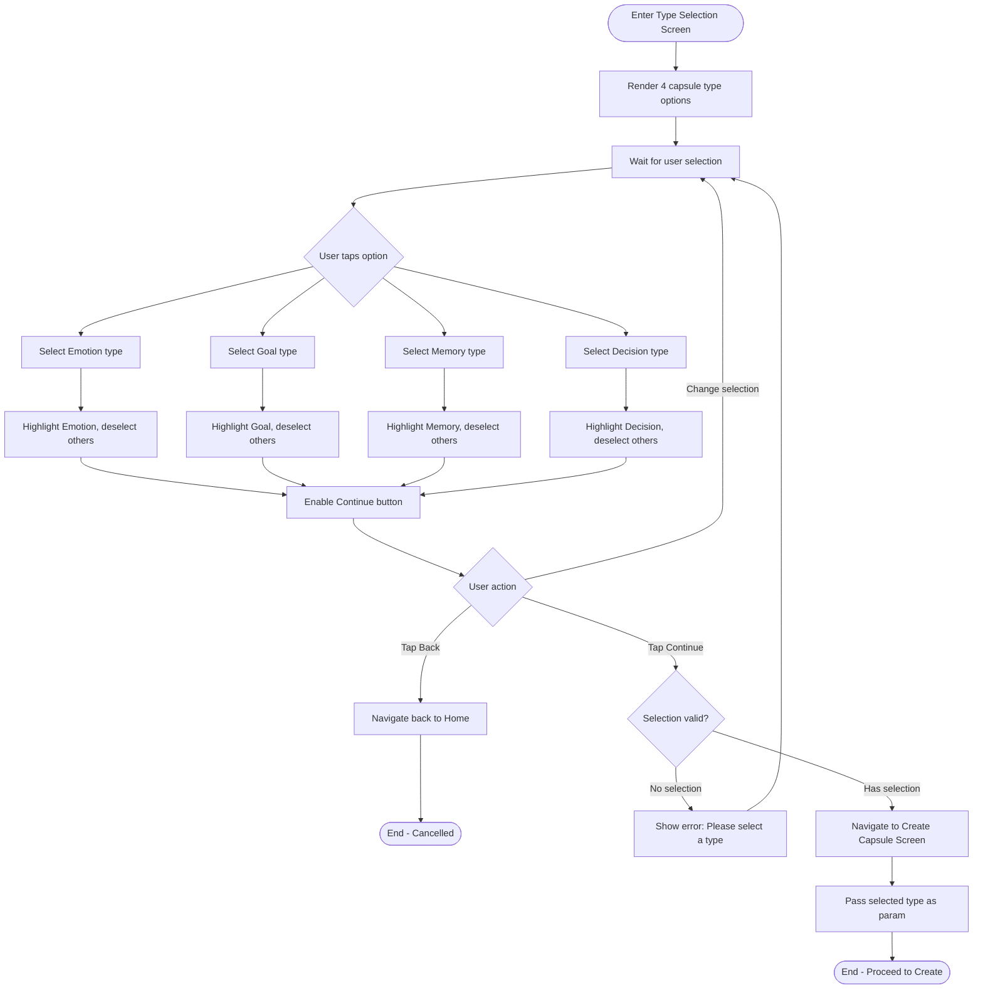

# F3: Capsule Type Selection - Activity Diagram

**Feature:** Capsule Type Selection
**Priority:** Must Have
**Dependencies:** F1 (Local Data Storage)

---

## 1. Overview

Man hinh cho phep nguoi dung chon 1 trong 4 loai capsule truoc khi tao noi dung. Moi loai co icon, mau sac va mo ta rieng de giup nguoi dung hieu muc dich.

---

## 2. Activity Diagram - Type Selection Flow



---

## 3. UI Components

### 3.1 Screen Layout

```
+----------------------------------+
|  [<- Back]     Select Type       |
+----------------------------------+
|                                  |
|  Choose what kind of time        |
|  capsule you want to create      |
|                                  |
|  +----------------------------+  |
|  |  [Heart Icon]              |  |
|  |  Emotion                   |  |
|  |  Capture your feelings     |  |
|  +----------------------------+  |
|                                  |
|  +----------------------------+  |
|  |  [Target Icon]             |  |
|  |  Goal                      |  |
|  |  Set and track your goals  |  |
|  +----------------------------+  |
|                                  |
|  +----------------------------+  |
|  |  [Camera Icon]             |  |
|  |  Memory                    |  |
|  |  Preserve special moments  |  |
|  +----------------------------+  |
|                                  |
|  +----------------------------+  |
|  |  [Scale Icon]              |  |
|  |  Decision                  |  |
|  |  Record important choices  |  |
|  +----------------------------+  |
|                                  |
|  [      Continue Button      ]   |
|                                  |
+----------------------------------+
```

### 3.2 Capsule Type Cards

| Type | Icon | Color | Description |
|------|------|-------|-------------|
| Emotion | Heart / Face | Pink/Purple | Capture how you feel right now |
| Goal | Target / Flag | Green/Blue | Set a goal and check back later |
| Memory | Camera / Photo | Orange/Yellow | Preserve a special moment |
| Decision | Scale / Crossroads | Blue/Gray | Record an important decision |

### 3.3 Card States

| State | Visual |
|-------|--------|
| Unselected | Muted border, normal background |
| Selected | Highlighted border, accent color, checkmark icon |
| Hover/Press | Slight scale up, shadow |

---

## 4. User Interaction Flow

### 4.1 Chon loai capsule

1. User vao Type Selection Screen (tu FAB tren Home)
2. App hien thi 4 options dang cards
3. User tap vao 1 option
4. App highlight option da chon, bo highlight cac option khac
5. App enable nut Continue

### 4.2 Doi loai capsule

1. User da chon 1 loai
2. User tap vao loai khac
3. App highlight loai moi, bo highlight loai cu
4. Nut Continue van enable

### 4.3 Continue den Create

1. User da chon 1 loai
2. User tap Continue
3. App navigate den Create Capsule Screen
4. App truyen `type` qua navigation params

### 4.4 Quay lai Home

1. User tap Back (header)
2. App navigate back to Home Screen
3. Khong luu selection

---

## 5. Validation Rules

| Rule | Description |
|------|-------------|
| Selection required | Phai chon 1 loai truoc khi Continue |
| Single selection | Chi chon duoc 1 loai tai 1 thoi diem |
| No default | Khong co loai nao duoc chon san |

---

## 6. Continue Button States

| State | Condition | Visual |
|-------|-----------|--------|
| Disabled | No selection | Grayed out, not clickable |
| Enabled | Has selection | Full color, clickable |
| Pressed | User pressing | Slightly darker |

---

## 7. Navigation

| Action | Destination |
|--------|-------------|
| Back button | Home Screen |
| Continue button | Create Capsule Screen (with type param) |
| Hardware back | Home Screen |

---

## 8. Data Passed to Next Screen

```typescript
interface NavigationParams {
  type: 'emotion' | 'goal' | 'memory' | 'decision';
}
```

---

## 9. Accessibility Considerations

| Aspect | Implementation |
|--------|----------------|
| Screen reader | Each card has descriptive label |
| Touch target | Cards minimum 48dp height |
| Visual feedback | Clear selected state |
| Keyboard nav | Support for tab navigation (if applicable) |

---

## 10. Error Handling

| Error | Handling |
|-------|----------|
| Tap Continue without selection | Show inline error, highlight empty state |
| Navigation failed | Show error, stay on screen |

---

*F3 Activity Diagram End*
