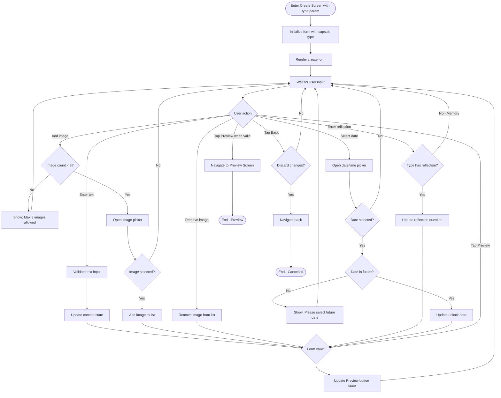
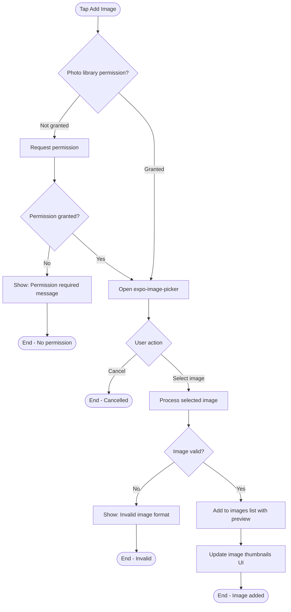
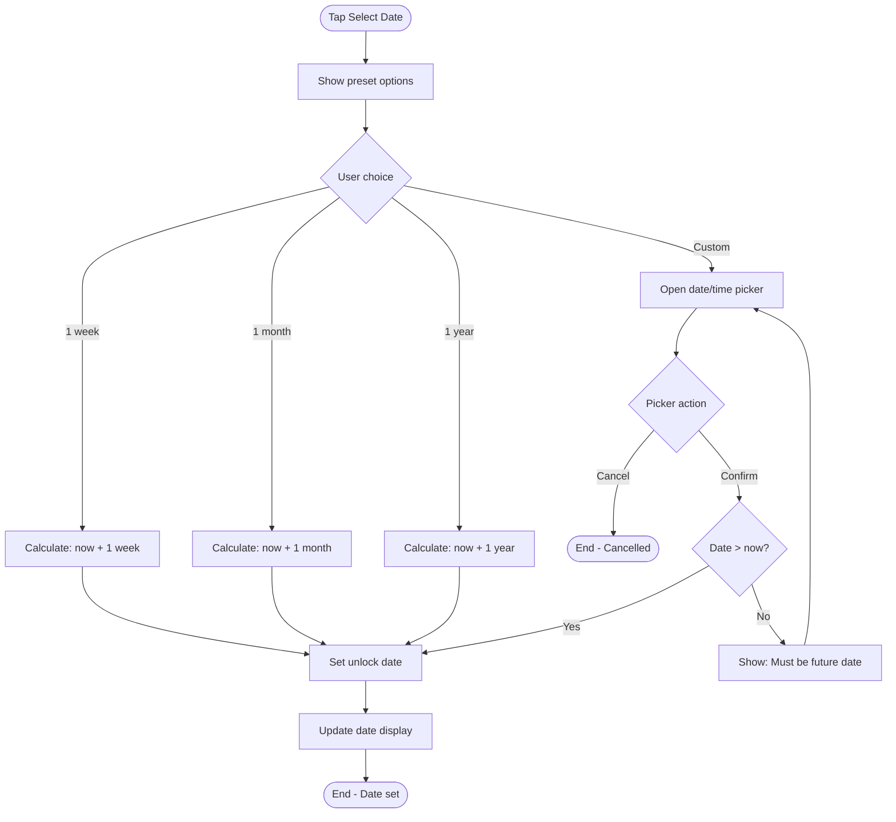

# F4: Create Capsule - Activity Diagram

**Feature:** Create Capsule
**Priority:** Must Have
**Dependencies:** F1 (Local Data Storage), F3 (Capsule Type Selection)

---

## 1. Overview

Man hinh tao capsule cho phep nguoi dung nhap noi dung text, chon anh (toi da 3), nhap cau hoi reflection (tuy loai), va chon thoi gian mo trong tuong lai. Sau khi hoan thanh, nguoi dung co the preview truoc khi lock.

---

## 2. Activity Diagram - Main Create Flow



---

## 3. Activity Diagram - Image Selection



---

## 4. Activity Diagram - Date Selection



---

## 5. UI Components

### 5.1 Screen Layout

```
+----------------------------------+
|  [<- Back]    Create [Type]      |
+----------------------------------+
|                                  |
|  What's on your mind?            |
|  +----------------------------+  |
|  |                            |  |
|  |  [Text input area]         |  |
|  |  max 2000 characters       |  |
|  |                            |  |
|  +----------------------------+  |
|  Character count: 0/2000         |
|                                  |
|  Add Photos (optional)           |
|  +------+ +------+ +------+      |
|  |[img1]| |[img2]| |[+Add]|      |
|  |  [x] | |  [x] | |      |      |
|  +------+ +------+ +------+      |
|                                  |
|  Question for future you         |  <- Hidden for Memory type
|  +----------------------------+  |
|  |  [Reflection question]     |  |
|  +----------------------------+  |
|                                  |
|  When to open?                   |
|  +----------------------------+  |
|  |  [1 week] [1 month] [1 yr] |  |
|  |  [Custom date picker]      |  |
|  +----------------------------+  |
|  Opens on: Jan 15, 2026 9:00 AM  |
|                                  |
|  [       Preview Capsule      ]  |
|                                  |
+----------------------------------+
```

### 5.2 Form Fields by Type

| Field | Emotion | Goal | Memory | Decision |
|-------|---------|------|--------|----------|
| Content (text) | Required | Required | Required | Required |
| Images | Optional (0-3) | Optional (0-3) | Optional (0-3) | Optional (0-3) |
| Reflection question | Required | Required | Hidden | Required |
| Unlock date | Required | Required | Required | Required |

---

## 6. User Interaction Flow

### 6.1 Nhap noi dung text

1. User tap vao text area
2. Keyboard hien len
3. User nhap noi dung (toi da 2000 ky tu)
4. Character counter update real-time
5. Neu vuot 2000, truncate va show warning

### 6.2 Them anh

1. User tap nut Add (hoac placeholder +)
2. App check permission
3. Neu chua co permission, request
4. Mo image picker
5. User chon anh tu gallery
6. App hien thi thumbnail voi nut X de xoa
7. Neu da co 3 anh, an nut Add

### 6.3 Xoa anh

1. User tap nut X tren thumbnail
2. Anh bi xoa khoi danh sach
3. Hien lai nut Add neu truoc do an

### 6.4 Nhap cau hoi reflection

1. User tap vao reflection field
2. User nhap cau hoi
3. Field chi hien thi cho Emotion/Goal/Decision
4. Memory type khong co field nay

### 6.5 Chon ngay mo

1. User chon preset (1 week/1 month/1 year) hoac Custom
2. Neu Custom: mo date/time picker
3. Date phai lon hon hien tai
4. Hien thi ngay da chon ben duoi

### 6.6 Preview

1. User tap Preview khi form valid
2. Navigate den Preview Screen
3. Pass form data qua navigation

---

## 7. Validation Rules

| Field | Rule | Error Message |
|-------|------|---------------|
| Content | Required, 1-2000 chars | "Please enter your message" |
| Content | Max 2000 chars | "Maximum 2000 characters" |
| Images | Max 3 | "Maximum 3 images allowed" |
| Reflection | Required (except Memory) | "Please enter a question for future you" |
| Unlock date | Required | "Please select when to open" |
| Unlock date | Must be future | "Please select a date in the future" |

---

## 8. Form State

```typescript
interface CreateFormState {
  type: 'emotion' | 'goal' | 'memory' | 'decision';
  content: string;
  images: Array<{
    uri: string;
    orderIndex: number;
  }>;
  reflectionQuestion: string | null;
  unlockAt: Date | null;
  isValid: boolean;
}
```

---

## 9. Preview Button States

| State | Condition | Visual |
|-------|-----------|--------|
| Disabled | Form invalid | Grayed out |
| Enabled | Form valid | Full color |

### Validation Check

```typescript
const isFormValid =
  content.trim().length > 0 &&
  content.length <= 2000 &&
  (type === 'memory' || reflectionQuestion?.trim().length > 0) &&
  unlockAt !== null &&
  unlockAt > new Date();
```

---

## 10. Error Handling

| Error | Handling |
|-------|----------|
| Permission denied | Show message with link to settings |
| Image picker failed | Show error toast, allow retry |
| Invalid image format | Show error, reject image |
| Date picker failed | Show error, allow retry |
| Form submission failed | Show error, keep form data |

---

## 11. Back Navigation

| Scenario | Behavior |
|----------|----------|
| Form empty | Navigate back immediately |
| Form has data | Show confirmation dialog |
| Confirm discard | Navigate back, clear form |
| Cancel discard | Stay on screen |

---

## 12. Data Passed to Preview

```typescript
interface PreviewData {
  type: 'emotion' | 'goal' | 'memory' | 'decision';
  content: string;
  images: string[]; // URIs
  reflectionQuestion: string | null;
  unlockAt: Date;
}
```

---

*F4 Activity Diagram End*
