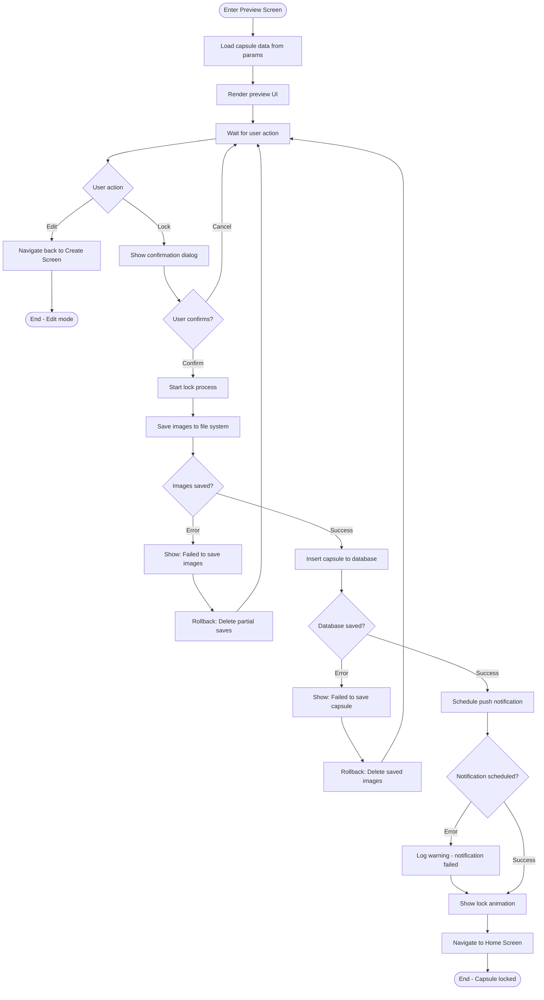
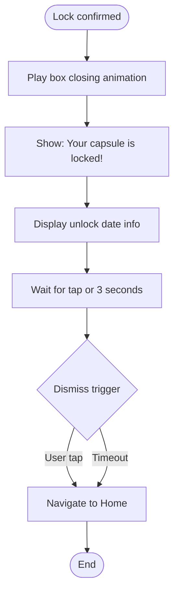

# F5: Lock Capsule - Activity Diagram

**Feature:** Lock Capsule
**Priority:** Must Have
**Dependencies:** F4 (Create Capsule)

---

## 1. Overview

Sau khi nguoi dung preview capsule, ho co the confirm de lock. Mot khi da lock, capsule khong the xem/sua/xoa cho den khi den thoi gian mo. Feature nay bao gom preview screen va lock confirmation.

---

## 2. Activity Diagram - Preview & Lock Flow



---

## 3. Activity Diagram - Lock Animation



---

## 4. UI Components

### 4.1 Preview Screen Layout

```
+----------------------------------+
|  [<- Edit]    Preview            |
+----------------------------------+
|                                  |
|  [Capsule Type Icon]             |
|  [Type Name] Capsule             |
|                                  |
|  +----------------------------+  |
|  |                            |  |
|  |  "Your message content     |  |
|  |   here displayed in full   |  |
|  |   with proper formatting"  |  |
|  |                            |  |
|  +----------------------------+  |
|                                  |
|  [img1] [img2] [img3]            |  <- If has images
|                                  |
|  Question for future you:        |  <- If has reflection
|  "Did you achieve your goal?"    |
|                                  |
|  +----------------------------+  |
|  |  Opens on:                 |  |
|  |  January 15, 2026          |  |
|  |  9:00 AM                   |  |
|  |  (in 1 year, 3 months)     |  |
|  +----------------------------+  |
|                                  |
|  [       Lock Capsule        ]   |
|                                  |
+----------------------------------+
```

### 4.2 Confirmation Dialog

```
+----------------------------------+
|                                  |
|  Lock this capsule?              |
|                                  |
|  Once locked, you cannot:        |
|  - View the contents             |
|  - Edit any information          |
|  - Delete the capsule            |
|                                  |
|  This capsule will unlock on:    |
|  January 15, 2026 at 9:00 AM     |
|                                  |
|  [Cancel]        [Lock Forever]  |
|                                  |
+----------------------------------+
```

### 4.3 Lock Success Animation

```
+----------------------------------+
|                                  |
|                                  |
|         [Box Animation]          |
|         Box closing/locking      |
|         with sparkle effect      |
|                                  |
|                                  |
|    Your capsule is locked!       |
|                                  |
|    See you on                    |
|    January 15, 2026              |
|                                  |
|    Tap anywhere to continue      |
|                                  |
+----------------------------------+
```

---

## 5. User Interaction Flow

### 5.1 Xem Preview

1. User vao Preview Screen tu Create Screen
2. App hien thi toan bo noi dung capsule
3. User co the xem lai text, anh, cau hoi, ngay mo
4. User co the quay lai chinh sua hoac lock

### 5.2 Quay lai chinh sua

1. User tap "Edit" (header left)
2. Navigate back to Create Screen
3. Giu nguyen du lieu form

### 5.3 Lock Capsule

1. User tap "Lock Capsule"
2. App hien thi confirmation dialog
3. Dialog giai thich rang capsule se khong the xem/sua/xoa
4. User confirm hoac cancel

### 5.4 Confirm Lock

1. User tap "Lock Forever"
2. App save images to file system
3. App insert capsule record to database
4. App schedule notification
5. App hien thi lock animation
6. Sau 3 giay hoac khi user tap, navigate to Home

### 5.5 Cancel Lock

1. User tap "Cancel" trong dialog
2. Dialog dong lai
3. User van o Preview Screen

---

## 6. Lock Process Steps

| Step | Action | Rollback on Fail |
|------|--------|------------------|
| 1 | Copy images to app directory | Delete partial copies |
| 2 | Insert image records to DB | Delete copied files |
| 3 | Insert capsule record | Delete images + image records |
| 4 | Schedule notification | Log warning (non-blocking) |
| 5 | Show success animation | N/A |

---

## 7. Database Changes

### Insert Capsule

```sql
INSERT INTO capsule (
  id, type, status, content,
  reflectionQuestion, reflectionAnswer,
  createdAt, unlockAt, openedAt, updatedAt
) VALUES (
  '{uuid}', '{type}', 'locked', '{content}',
  '{question}', NULL,
  {timestamp}, {unlockTimestamp}, NULL, {timestamp}
);
```

### Insert Images

```sql
INSERT INTO capsule_image (
  id, capsuleId, filePath, orderIndex, createdAt
) VALUES (
  '{uuid}', '{capsuleId}', '{path}', {index}, {timestamp}
);
```

---

## 8. Notification Scheduling

```typescript
// Schedule local notification
await Notifications.scheduleNotificationAsync({
  content: {
    title: 'Time Capsule Ready!',
    body: `Your ${type} capsule is ready to open!`,
    data: { capsuleId: id },
  },
  trigger: {
    date: unlockAt,
  },
});
```

---

## 9. Lock Animation Specs

| Element | Animation |
|---------|-----------|
| Box icon | Scale down, rotate slightly |
| Lock icon | Fade in, bounce |
| Sparkles | Particle effect around box |
| Text | Fade in with delay |
| Duration | 2-3 seconds total |

---

## 10. Error Handling

| Error | User Message | Action |
|-------|--------------|--------|
| Image save failed | "Failed to save images. Please try again." | Stay on preview |
| Database error | "Failed to save capsule. Please try again." | Rollback, stay on preview |
| Notification failed | (No message - silent) | Continue, log warning |
| Unknown error | "Something went wrong. Please try again." | Stay on preview |

---

## 11. Edge Cases

| Case | Handling |
|------|----------|
| App killed during lock | Partial data may exist - cleanup on next launch |
| No notification permission | Prompt to enable, continue without if declined |
| Storage full | Show error before attempting save |
| Very large images | Compress or show size warning |

---

## 12. Security Considerations

| Aspect | Implementation |
|--------|----------------|
| Cannot view locked capsule | No API to retrieve content when status='locked' |
| Cannot edit | No edit endpoint for locked capsules |
| Cannot delete | Delete blocked when status='locked' |
| Timestamp integrity | Use device time (accept user may manipulate) |

---

*F5 Activity Diagram End*
