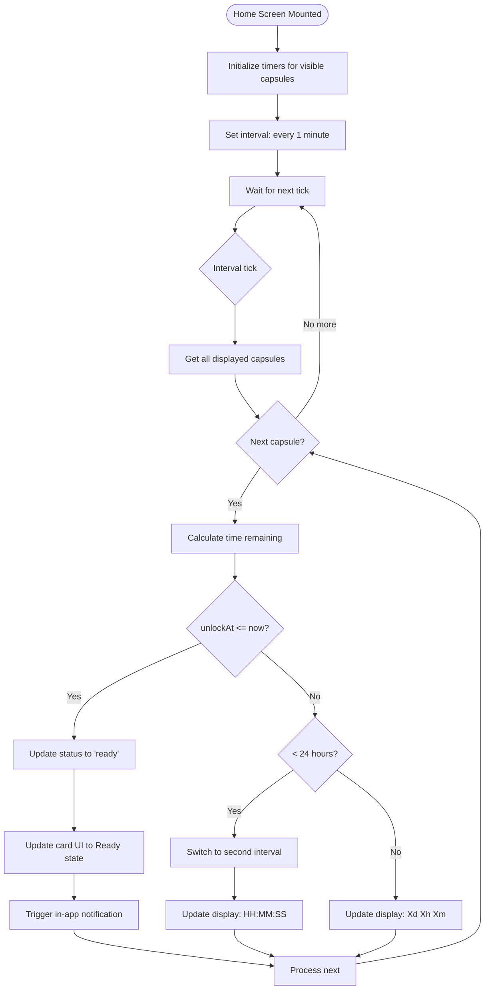
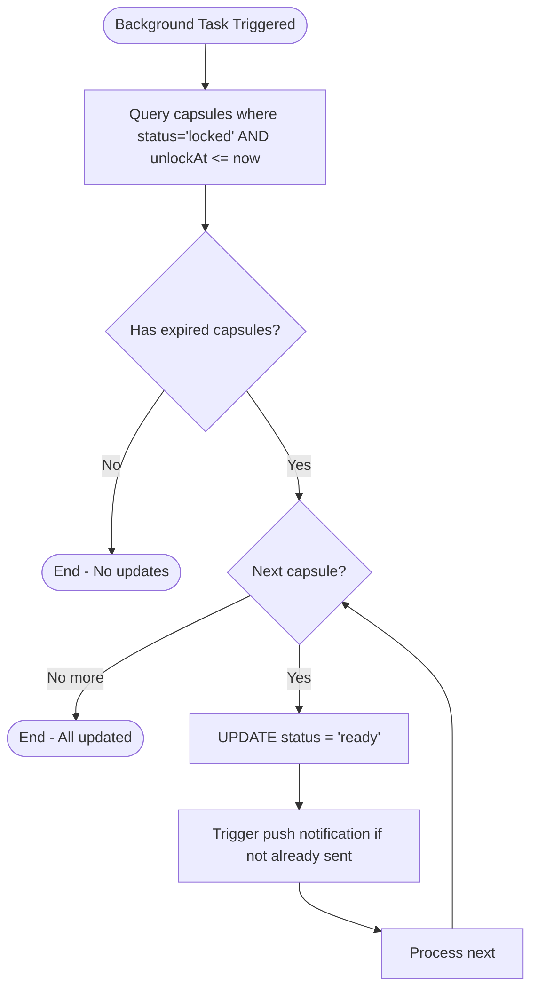
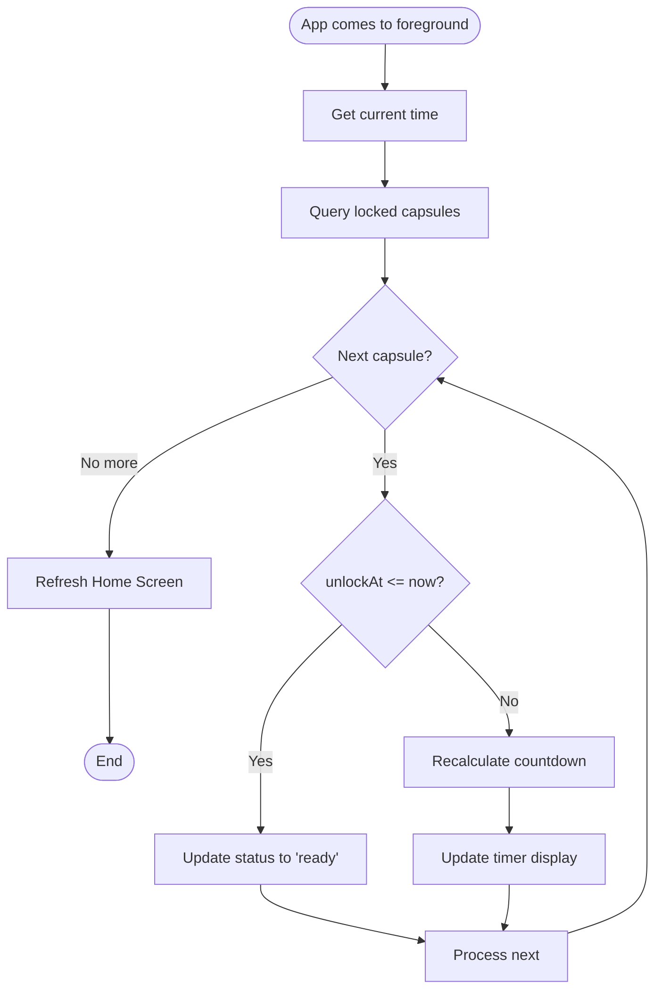

# F6: Capsule Timer - Activity Diagram

**Feature:** Capsule Timer
**Priority:** Must Have
**Dependencies:** F5 (Lock Capsule)

---

## 1. Overview

Timer dem nguoc thoi gian con lai cho den khi capsule co the mo. Hien thi tren Home Screen va cap nhat real-time. Khi het countdown, status capsule chuyen tu "locked" sang "ready".

---

## 2. Activity Diagram - Timer Display Update



---

## 3. Activity Diagram - Background Status Check



---

## 4. Activity Diagram - App Resume



---

## 5. Timer Display Format

### 5.1 Format Rules

| Time Remaining | Format | Example |
|----------------|--------|---------|
| >= 1 year | `Xy Xmo` | 1y 3mo |
| >= 1 month (< 1 year) | `Xmo Xd` | 2mo 15d |
| >= 1 week (< 1 month) | `Xw Xd` | 2w 3d |
| >= 1 day (< 1 week) | `Xd Xh` | 3d 12h |
| >= 1 hour (< 1 day) | `Xh Xm Xs` | 5h 30m 45s |
| < 1 hour | `Xm Xs` | 30m 15s |
| <= 0 | Ready badge | "Ready!" |

### 5.2 Format Examples

```typescript
formatCountdown(remainingMs: number): string {
  if (remainingMs <= 0) return 'Ready!';

  const seconds = Math.floor(remainingMs / 1000);
  const minutes = Math.floor(seconds / 60);
  const hours = Math.floor(minutes / 60);
  const days = Math.floor(hours / 24);
  const weeks = Math.floor(days / 7);
  const months = Math.floor(days / 30);
  const years = Math.floor(days / 365);

  if (years > 0) return `${years}y ${months % 12}mo`;
  if (months > 0) return `${months}mo ${days % 30}d`;
  if (weeks > 0) return `${weeks}w ${days % 7}d`;
  if (days > 0) return `${days}d ${hours % 24}h`;
  if (hours > 0) return `${hours}h ${minutes % 60}m ${seconds % 60}s`;
  return `${minutes}m ${seconds % 60}s`;
}
```

---

## 6. UI Components

### 6.1 Timer on Capsule Card

```
+------------------+
|  [Type Icon]     |
|                  |
|  3d 12h 30m      |  <- Timer display
|  [Progress bar]  |  <- Optional visual
|                  |
+------------------+

+------------------+
|  [Type Icon]     |
|                  |
|    Ready!        |  <- When unlocked
|  [Glow effect]   |
|                  |
+------------------+
```

### 6.2 Timer States

| State | Visual | Animation |
|-------|--------|-----------|
| Counting | Normal text | None |
| < 24 hours | Accent color | Subtle pulse |
| < 1 hour | Urgent color | Faster pulse |
| Ready | "Ready!" badge | Glow + bounce |

---

## 7. Update Intervals

| Time Remaining | Update Interval | Reason |
|----------------|-----------------|--------|
| > 1 day | Every 1 minute | Save battery |
| < 1 day | Every 1 second | Show seconds ticking |
| Ready | No updates | Static state |

---

## 8. User Interaction Flow

### 8.1 Xem countdown tren Home

1. User mo Home Screen
2. App load capsules tu database
3. Voi moi capsule, tinh thoi gian con lai
4. Hien thi countdown theo format phu hop
5. Timer tu dong update moi phut (hoac giay neu < 1 ngay)

### 8.2 Khi capsule het countdown

1. Timer dem xuong 0
2. App update status trong database thanh 'ready'
3. UI card doi thanh Ready state (badge, glow)
4. Neu app dang active: hien thi in-app notification
5. User co the tap de mo capsule

### 8.3 Mo app sau khi capsule het han

1. User mo app sau thoi gian unlock
2. App check va update status cua cac capsule da het han
3. Capsules hien thi Ready state
4. Push notification da duoc gui truoc do (F7)

---

## 9. Background Processing

### 9.1 Background Task Schedule

```typescript
// Register background fetch task
TaskManager.defineTask(BACKGROUND_FETCH_TASK, async () => {
  const now = Date.now();

  // Query and update expired capsules
  await db.run(`
    UPDATE capsule
    SET status = 'ready', updatedAt = ?
    WHERE status = 'locked' AND unlockAt <= ?
  `, [now, now]);

  return BackgroundFetch.BackgroundFetchResult.NewData;
});

// Schedule minimum interval (iOS: 15 min, Android: 15 min)
await BackgroundFetch.registerTaskAsync(BACKGROUND_FETCH_TASK, {
  minimumInterval: 15 * 60, // 15 minutes
  stopOnTerminate: false,
  startOnBoot: true,
});
```

### 9.2 Limitations

| Platform | Limitation |
|----------|------------|
| iOS | Minimum 15 min interval, system decides when to run |
| Android | Minimum 15 min interval, Doze mode affects timing |
| Both | Not guaranteed to run at exact time |

---

## 10. Sync Strategy

| Event | Action |
|-------|--------|
| App launch | Check and update all expired capsules |
| App resume (foreground) | Check and update all expired capsules |
| Timer tick | Update individual capsule if expired |
| Background task | Batch update all expired capsules |

---

## 11. Performance Considerations

| Aspect | Implementation |
|--------|----------------|
| Battery | Use minute interval when > 1 day |
| CPU | Only update visible capsules |
| Database | Single batch query for updates |
| Re-renders | Only update changed cards |

---

## 12. Error Handling

| Error | Handling |
|-------|----------|
| Database query failed | Retry on next interval |
| Status update failed | Log error, retry |
| Background task failed | Rely on app foreground check |
| Invalid date | Show error, remove from display |

---

## 13. Edge Cases

| Case | Handling |
|------|----------|
| Device time changed backward | Timer shows more time, recalculate |
| Device time changed forward | Immediate status update |
| Multiple capsules expire at once | Batch update all |
| Very long countdown (years) | Show years and months |

---

*F6 Activity Diagram End*
