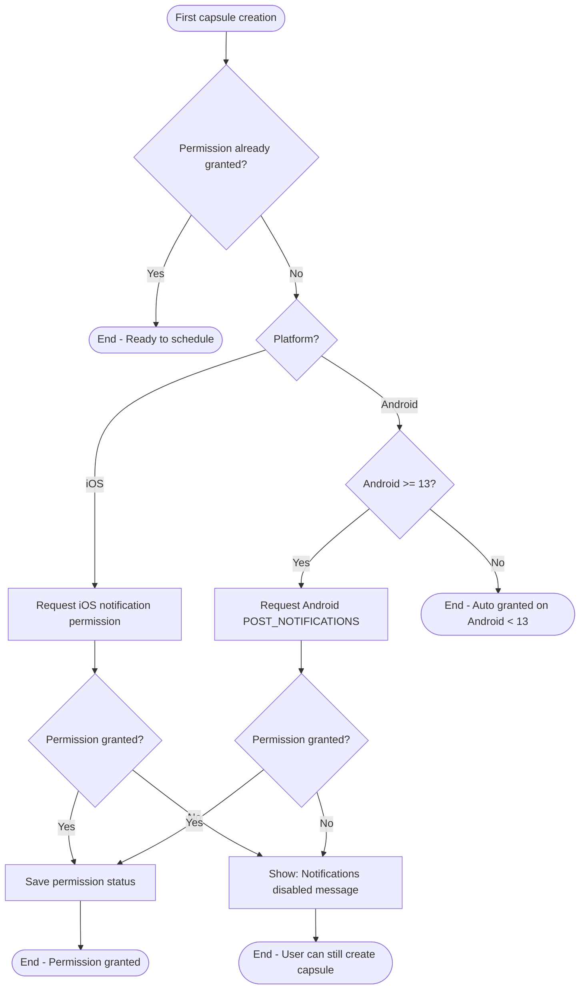
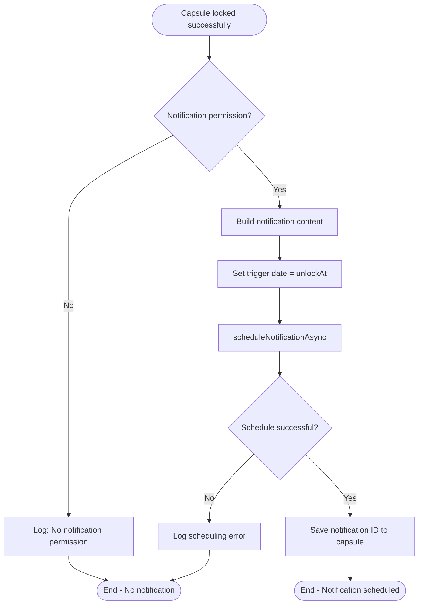
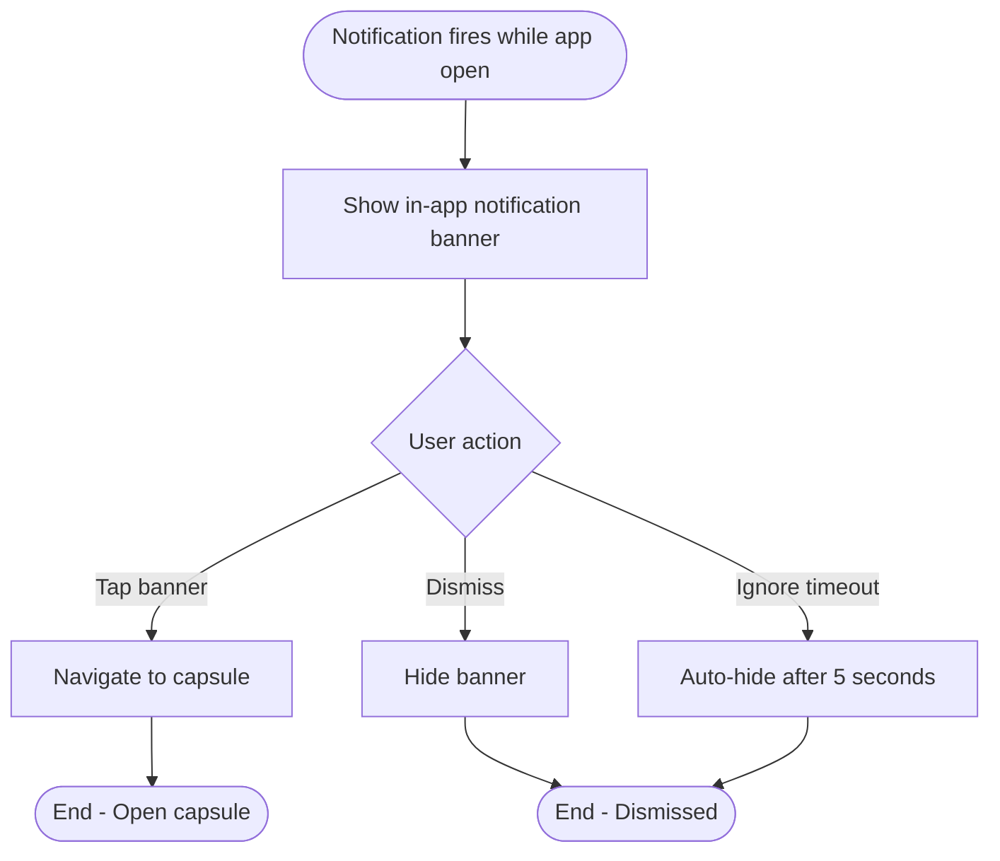
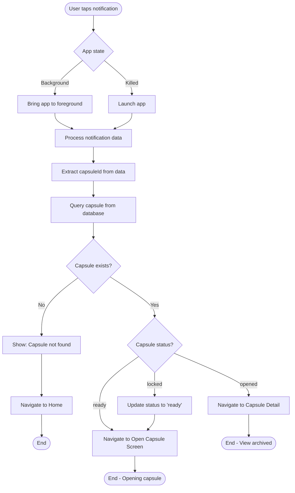

# F7: Push Notification - Activity Diagram

**Feature:** Push Notification
**Priority:** Must Have
**Dependencies:** F5 (Lock Capsule)

---

## 1. Overview

Push Notification thong bao cho nguoi dung khi capsule den thoi gian mo. Su dung Expo Notifications de schedule local notification. Khi user tap notification, app mo va navigate den capsule do.

---

## 2. Activity Diagram - Request Permission



---

## 3. Activity Diagram - Schedule Notification



---

## 4. Activity Diagram - Notification Received (Foreground)



---

## 5. Activity Diagram - Notification Received (Background/Killed)



---

## 6. Notification Content

### 6.1 Content by Capsule Type

| Type | Title | Body |
|------|-------|------|
| Emotion | Time Capsule Ready! | Your Emotion capsule is ready to open! |
| Goal | Time Capsule Ready! | Your Goal capsule is ready to open! |
| Memory | Time Capsule Ready! | Your Memory capsule is ready to open! |
| Decision | Time Capsule Ready! | Your Decision capsule is ready to open! |

### 6.2 Notification Structure

```typescript
interface NotificationContent {
  title: string;
  body: string;
  data: {
    capsuleId: string;
    type: string;
  };
  sound: 'default';
  badge: number; // iOS only
}
```

---

## 7. Implementation Details

### 7.1 Schedule Notification

```typescript
async function scheduleNotification(capsule: Capsule): Promise<string | null> {
  const permission = await Notifications.getPermissionsAsync();
  if (permission.status !== 'granted') {
    console.warn('Notification permission not granted');
    return null;
  }

  try {
    const notificationId = await Notifications.scheduleNotificationAsync({
      content: {
        title: 'Time Capsule Ready!',
        body: `Your ${capsule.type} capsule is ready to open!`,
        data: {
          capsuleId: capsule.id,
          type: capsule.type,
        },
        sound: 'default',
      },
      trigger: {
        date: new Date(capsule.unlockAt),
      },
    });

    return notificationId;
  } catch (error) {
    console.error('Failed to schedule notification:', error);
    return null;
  }
}
```

### 7.2 Handle Notification Response

```typescript
// Set up notification response handler
Notifications.addNotificationResponseReceivedListener((response) => {
  const data = response.notification.request.content.data;

  if (data.capsuleId) {
    // Navigate to capsule
    navigationRef.current?.navigate('OpenCapsule', {
      capsuleId: data.capsuleId,
    });
  }
});
```

### 7.3 Handle Foreground Notification

```typescript
// Set up foreground notification handler
Notifications.addNotificationReceivedListener((notification) => {
  const data = notification.request.content.data;

  // Show in-app notification
  showInAppNotification({
    title: notification.request.content.title,
    body: notification.request.content.body,
    onPress: () => {
      navigationRef.current?.navigate('OpenCapsule', {
        capsuleId: data.capsuleId,
      });
    },
  });
});
```

---

## 8. User Interaction Flow

### 8.1 Lan dau tao capsule

1. User tap Lock de tao capsule
2. App check notification permission
3. Neu chua co, hien dialog xin permission
4. User cho phep hoac tu choi
5. Neu cho phep, app schedule notification

### 8.2 Nhan notification khi app dong

1. Den gio unlock, notification hien tren device
2. User tap notification
3. App mo va navigate den Open Capsule Screen
4. User co the mo capsule

### 8.3 Nhan notification khi app dang mo

1. Den gio unlock, in-app banner hien o tren
2. User tap banner de di den capsule
3. Hoac banner tu an sau 5 giay

---

## 9. Permission Handling

### 9.1 iOS Permission Flow

| Step | Action |
|------|--------|
| 1 | Call `requestPermissionsAsync()` |
| 2 | System dialog appears |
| 3 | User taps Allow or Don't Allow |
| 4 | Save result to AsyncStorage |

### 9.2 Android Permission Flow

| Android Version | Behavior |
|-----------------|----------|
| < 13 (API 32) | Auto granted |
| >= 13 (API 33) | Must request POST_NOTIFICATIONS |

---

## 10. Notification Categories (Future)

```typescript
// Define action categories (optional)
await Notifications.setNotificationCategoryAsync('capsule', [
  {
    identifier: 'open',
    buttonTitle: 'Open Now',
    options: { opensAppToForeground: true },
  },
  {
    identifier: 'remind',
    buttonTitle: 'Remind Later',
    options: { opensAppToForeground: false },
  },
]);
```

---

## 11. Error Handling

| Error | Handling |
|-------|----------|
| Permission denied | Log warning, continue without notification |
| Schedule failed | Log error, continue (capsule still works) |
| Capsule not found on tap | Show error, navigate to Home |
| Multiple notifications | Only one per capsule |

---

## 12. Edge Cases

| Case | Handling |
|------|----------|
| App uninstalled | Notification cancelled by system |
| Device reboot | Expo handles rescheduling |
| Past date scheduled | Notification fires immediately |
| Notification disabled in settings | Respect user choice |
| Time zone change | Use UTC internally |

---

## 13. Testing Checklist

| Test | Expected Result |
|------|-----------------|
| Schedule notification | Notification ID returned |
| Notification at unlock time | Notification appears |
| Tap notification (app killed) | App opens, navigates to capsule |
| Tap notification (app background) | App foregrounds, navigates |
| Tap notification (app open) | In-app banner shown |
| Permission denied | Capsule created without notification |

---

*F7 Activity Diagram End*
