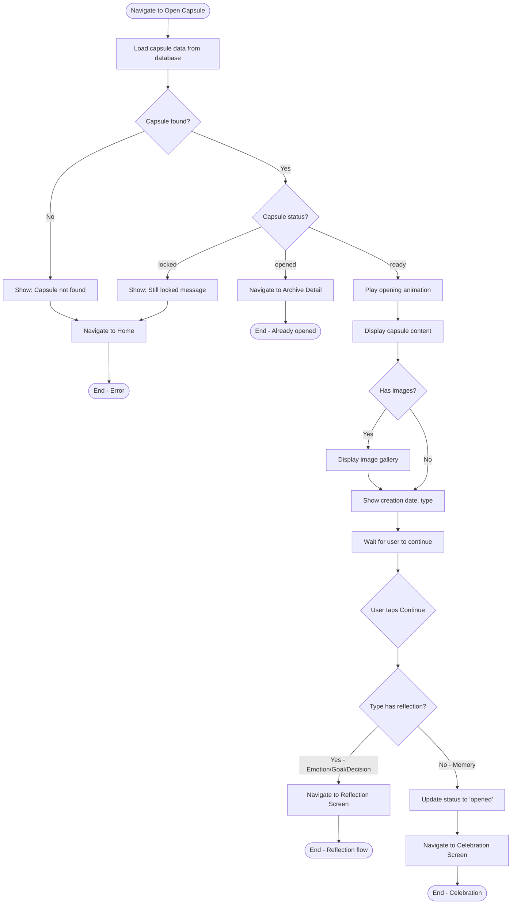
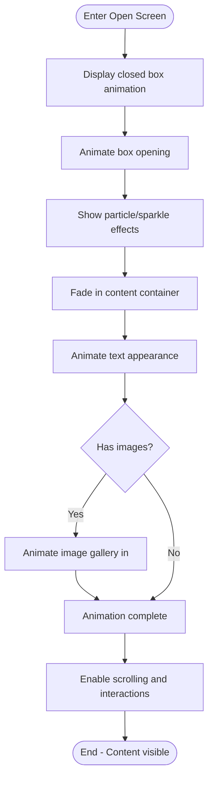

# F8: Open Capsule - Activity Diagram

**Feature:** Open Capsule
**Priority:** Must Have
**Dependencies:** F5 (Lock Capsule), F6 (Capsule Timer)

---

## 1. Overview

Khi capsule den thoi gian unlock (status = 'ready'), nguoi dung co the mo de xem noi dung. Man hinh hien thi animation mo hop, noi dung text, anh, va thong tin capsule. Sau do chuyen sang Reflection (neu co) hoac Celebration.

---

## 2. Activity Diagram - Open Capsule Flow



---

## 3. Activity Diagram - Opening Animation



---

## 4. UI Components

### 4.1 Open Screen Layout

```
+----------------------------------+
|            [X Close]             |
+----------------------------------+
|                                  |
|        [Opening Animation]       |
|        Box opens with light      |
|                                  |
+----------------------------------+
            |
            v (after animation)
+----------------------------------+
|            [X Close]             |
+----------------------------------+
|                                  |
|  [Type Icon]  Emotion Capsule    |
|  Created on Dec 20, 2024         |
|                                  |
|  +----------------------------+  |
|  |                            |  |
|  |  "I'm feeling really       |  |
|  |   excited about the new    |  |
|  |   year ahead. I hope       |  |
|  |   2025 brings..."          |  |
|  |                            |  |
|  +----------------------------+  |
|                                  |
|  [img1]  [img2]  [img3]          |
|                                  |
|  Time locked: 1 year, 3 months   |
|                                  |
|  [       Continue        ]       |
|                                  |
+----------------------------------+
```

### 4.2 Content Display Components

| Component | Description |
|-----------|-------------|
| Type Badge | Icon + type name (Emotion/Goal/Memory/Decision) |
| Creation Date | "Created on [date]" |
| Content Text | Full text content with proper formatting |
| Image Gallery | Horizontal scrollable images (tap to zoom) |
| Duration Info | "Time locked: X years, X months, X days" |
| Continue Button | Proceeds to Reflection or Celebration |

---

## 5. User Interaction Flow

### 5.1 Mo capsule tu Home

1. User tap capsule co trang thai "Ready" tren Home
2. App navigate den Open Capsule Screen
3. Hien thi opening animation (hop mo ra)
4. Sau animation, hien thi noi dung day du

### 5.2 Mo capsule tu notification

1. User tap notification
2. App mo va navigate den Open Capsule Screen
3. Cung flow nhu tren

### 5.3 Xem noi dung

1. User doc text content
2. User co the scroll neu noi dung dai
3. Tap anh de xem full screen (zoom)
4. User tap Continue khi san sang

### 5.4 Tiep tuc sau khi xem

1. User tap Continue
2. Neu loai Emotion/Goal/Decision: chuyen sang Reflection
3. Neu loai Memory: cap nhat status va chuyen sang Celebration

---

## 6. Image Gallery

### 6.1 Gallery Display

```
+----------------------------------+
|  [img1]  [img2]  [img3]          |
|  Tap to view full screen         |
+----------------------------------+
```

### 6.2 Full Screen Image View

```
+----------------------------------+
|  [X Close]              [1/3]    |
+----------------------------------+
|                                  |
|                                  |
|       [Full Screen Image]        |
|       Pinch to zoom              |
|       Swipe to navigate          |
|                                  |
|                                  |
+----------------------------------+
|  o   o   o  (page indicator)     |
+----------------------------------+
```

### 6.3 Image Viewer Features

| Feature | Implementation |
|---------|----------------|
| Swipe left/right | Navigate between images |
| Pinch to zoom | Zoom in/out |
| Double tap | Toggle zoom |
| Tap X or swipe down | Close viewer |
| Page indicator | Dots showing current image |

---

## 7. Opening Animation Specs

| Element | Animation | Duration |
|---------|-----------|----------|
| Box container | Scale from 0.8 to 1 | 300ms |
| Box lid | Rotate open (3D) | 500ms |
| Light rays | Fade in, expand | 400ms |
| Particles | Float up and fade | 600ms |
| Content | Fade in, slide up | 400ms |
| Total | | ~1500ms |

---

## 8. Data Displayed

```typescript
interface OpenCapsuleData {
  id: string;
  type: 'emotion' | 'goal' | 'memory' | 'decision';
  content: string;
  images: string[]; // File paths
  reflectionQuestion: string | null;
  createdAt: Date;
  unlockAt: Date;
  // Calculated
  timeLocked: string; // "1 year, 3 months"
}
```

---

## 9. Close/Cancel Behavior

| Action | Behavior |
|--------|----------|
| Tap X (before Continue) | Confirm dialog: Leave without finishing? |
| Confirm leave | Navigate to Home, capsule stays 'ready' |
| Cancel leave | Stay on Open screen |
| Tap X (Memory, after Continue) | Status already 'opened', navigate to Home |

### Confirm Leave Dialog

```
+----------------------------------+
|                                  |
|  Leave without finishing?        |
|                                  |
|  You can come back to open       |
|  this capsule anytime.           |
|                                  |
|  [Stay]              [Leave]     |
|                                  |
+----------------------------------+
```

---

## 10. Navigation Flow

| From | To | Trigger |
|------|----|---------|
| Home Screen | Open Capsule | Tap ready capsule |
| Notification | Open Capsule | Tap notification |
| Open Capsule | Reflection | Continue (has reflection) |
| Open Capsule | Celebration | Continue (Memory type) |
| Open Capsule | Home | X button (confirm leave) |

---

## 11. Error Handling

| Error | Handling |
|-------|----------|
| Capsule not found | Show error, navigate Home |
| Image file missing | Show placeholder, log warning |
| Database error | Show error, allow retry |
| Animation failed | Skip animation, show content |

---

## 12. Performance Considerations

| Aspect | Implementation |
|--------|----------------|
| Large images | Use expo-image with caching |
| Long text | Virtualized scroll if very long |
| Animation | Use Reanimated for smooth 60fps |
| Image loading | Lazy load, show placeholder |

---

## 13. Accessibility

| Aspect | Implementation |
|--------|----------------|
| Screen reader | Describe capsule content |
| Images | Alt text: "Photo 1 of 3" |
| Animation | Respect reduce motion setting |
| Touch targets | Minimum 48dp |

---

*F8 Activity Diagram End*
