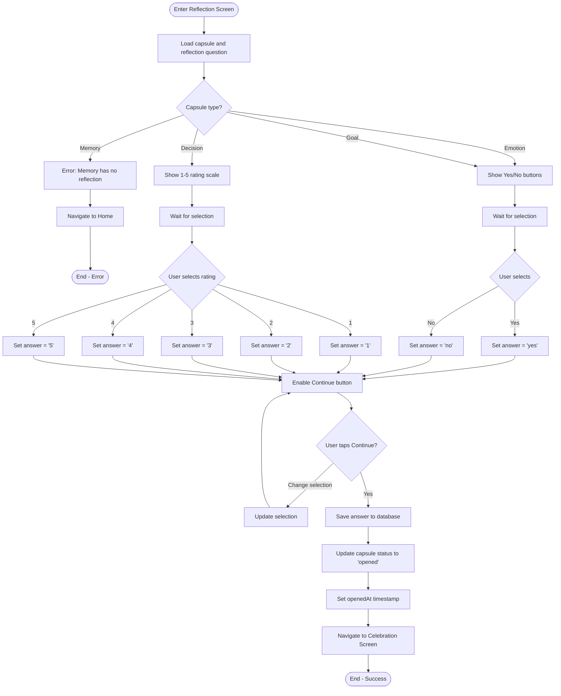

# F9: Reflection Response - Activity Diagram

**Feature:** Reflection Response
**Priority:** Must Have
**Dependencies:** F8 (Open Capsule)

---

## 1. Overview

Sau khi xem noi dung capsule (loai Emotion/Goal/Decision), nguoi dung tra loi cau hoi reflection da tao. Emotion/Goal dung Yes/No, Decision dung rating 1-5. Cau tra loi duoc luu va chuyen sang Celebration.

---

## 2. Activity Diagram - Reflection Flow



---

## 3. UI Components

### 3.1 Yes/No Reflection (Emotion/Goal)

```
+----------------------------------+
|  [<- Back]    Reflect            |
+----------------------------------+
|                                  |
|  [Type Icon]                     |
|                                  |
|  Your question:                  |
|  +----------------------------+  |
|  |                            |  |
|  |  "Did I achieve my goal    |  |
|  |   of running 5k?"          |  |
|  |                            |  |
|  +----------------------------+  |
|                                  |
|  How do you answer?              |
|                                  |
|  +------------+ +------------+   |
|  |            | |            |   |
|  |    YES     | |     NO     |   |
|  |     :)     | |     :(     |   |
|  |            | |            |   |
|  +------------+ +------------+   |
|                                  |
|  [       Continue        ]       |
|                                  |
+----------------------------------+
```

### 3.2 Rating Reflection (Decision)

```
+----------------------------------+
|  [<- Back]    Reflect            |
+----------------------------------+
|                                  |
|  [Type Icon]                     |
|                                  |
|  Your question:                  |
|  +----------------------------+  |
|  |                            |  |
|  |  "Was quitting my job      |  |
|  |   the right decision?"     |  |
|  |                            |  |
|  +----------------------------+  |
|                                  |
|  Rate your decision:             |
|                                  |
|  1    2    3    4    5           |
|  [*] [*] [*] [*] [*]             |
|  Bad         Neutral      Great  |
|                                  |
|  [       Continue        ]       |
|                                  |
+----------------------------------+
```

### 3.3 Button States

| Element | Unselected | Selected |
|---------|------------|----------|
| Yes button | Border only | Filled green, checkmark |
| No button | Border only | Filled red, X mark |
| Rating star | Empty star | Filled star |
| Continue | Disabled (gray) | Enabled (accent) |

---

## 4. User Interaction Flow

### 4.1 Tra loi Yes/No (Emotion/Goal)

1. User den man hinh Reflection tu Open Capsule
2. App hien thi cau hoi reflection
3. User tap Yes hoac No
4. Button duoc chon highlight
5. Continue button enabled
6. User tap Continue
7. App luu cau tra loi va chuyen sang Celebration

### 4.2 Tra loi Rating (Decision)

1. User den man hinh Reflection tu Open Capsule
2. App hien thi cau hoi reflection
3. User tap 1 trong 5 rating
4. Stars fill up to selected rating
5. Continue button enabled
6. User tap Continue
7. App luu cau tra loi va chuyen sang Celebration

### 4.3 Thay doi cau tra loi

1. User da chon mot cau tra loi
2. User tap cau tra loi khac
3. UI update de hien thi selection moi
4. Continue van enabled

---

## 5. Validation Rules

| Rule | Description |
|------|-------------|
| Required | Phai chon cau tra loi truoc khi Continue |
| Single selection | Chi chon duoc 1 option |
| Yes/No for Emotion/Goal | 2 options only |
| Rating for Decision | 5 options (1-5) |

---

## 6. Database Update

### Save Reflection Answer

```sql
UPDATE capsule
SET
  status = 'opened',
  reflectionAnswer = ?,
  openedAt = ?,
  updatedAt = ?
WHERE id = ?;
```

### Answer Values

| Type | Possible Values |
|------|-----------------|
| Emotion | 'yes', 'no' |
| Goal | 'yes', 'no' |
| Decision | '1', '2', '3', '4', '5' |
| Memory | NULL (no reflection) |

---

## 7. Navigation

| Action | Destination |
|--------|-------------|
| Back button | Open Capsule Screen (capsule still 'ready') |
| Continue (after selecting) | Celebration Screen |
| Hardware back | Confirm dialog, then Open Capsule |

### Back Navigation Behavior

| Scenario | Behavior |
|----------|----------|
| No selection made | Go back without warning |
| Selection made but not submitted | Confirm dialog: Discard answer? |
| Answer submitted | Cannot go back (already in Celebration) |

---

## 8. Celebration Effect Mapping

Cau tra loi se quyet dinh loai celebration effect (F10):

| Answer | Effect Type |
|--------|-------------|
| Yes | Positive celebration (confetti) |
| No | Encouraging animation |
| Rating 4-5 | Positive celebration |
| Rating 3 | Neutral animation |
| Rating 1-2 | Encouraging animation |

---

## 9. Animation Specs

### 9.1 Button Selection

| Element | Animation |
|---------|-----------|
| Yes/No button | Scale 1.0 -> 1.05, border fill |
| Rating stars | Fill with color, subtle bounce |
| Continue button | Fade in enabled state |

### 9.2 Transition to Celebration

| Animation | Duration |
|-----------|----------|
| Screen fade out | 300ms |
| Celebration fade in | 300ms |

---

## 10. Error Handling

| Error | Handling |
|-------|----------|
| Database save failed | Show error, allow retry |
| Capsule not found | Navigate to Home with error |
| Invalid type | Navigate to Home (should not happen) |

---

## 11. Accessibility

| Aspect | Implementation |
|--------|----------------|
| Screen reader | Announce question and options |
| Yes/No buttons | Label: "Answer Yes" / "Answer No" |
| Rating | Label: "Rate 1 out of 5" etc. |
| Selection feedback | Haptic vibration on selection |

---

## 12. Data Passed to Celebration

```typescript
interface CelebrationParams {
  capsuleId: string;
  type: 'emotion' | 'goal' | 'memory' | 'decision';
  answer: 'yes' | 'no' | '1' | '2' | '3' | '4' | '5' | null;
}
```

---

## 13. Edge Cases

| Case | Handling |
|------|----------|
| App killed before save | Capsule stays 'ready', can try again |
| Multiple rapid taps | Debounce, only save once |
| Back then forward | Previous selection cleared |

---

*F9 Activity Diagram End*
